# The MRF Timing System

The MRF Event System provides a complete timing distribution system
including timing signal generation with only a few components. The
system is capable of generating subharmonic frequency signals, triggers
and sequences of events, etc. that are synchronous to an externally
provided master clock reference and (optionally) another signal, for
example mains voltage phase. Support for timestamps makes the system a
global timebase and allows attaching timestamps to collected data and
performed actions.

## Timing System Principle of Operation

A basic setup of the timing system consists of an Event Generator (EVG),
the distribution layer (Fan-Out, or Repeater) and Event Receivers (EVR).
See the picture below.


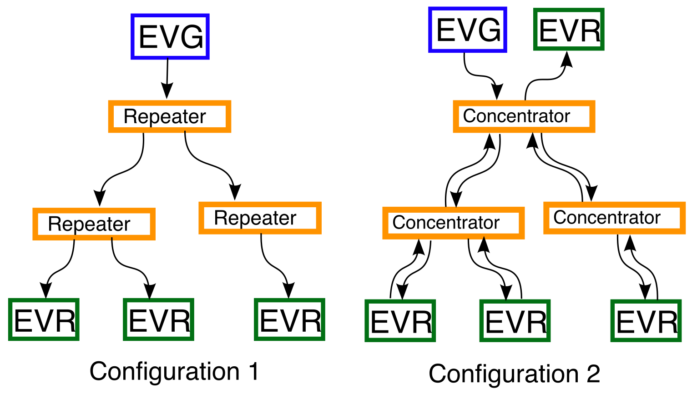{w=500px}

The event system functions by transmitting a bit stream, commonly called
event stream, between the system components. The event stream is a
continuous flow of event frames, generated and sent out by the event
generator and sent out at the \"event clock\" rate. The event clock rate
is derived from an external RF clock or optionally an on-board clock
generator. The event stream transmitted by the Event Generator is phase
locked to the clock reference. 

In the basic use pattern (Configuration 1), the event stream is
unidirectional, generated by the EVG and then multiplied using repeaters
to a number of event receivers. Synchronicity is preserved in the
distribution layer. Finally, the EVRs lock to the bitstream signal phase
and thus are precisely synchronised to the bitstream, and consequently 
to each other with a high precision.

The physical media for transmission is optical fiber.

There is also the possibility for bi-directional signaling
(Configuration 2), where EVRs can not only receive the event stream but
also generate and send an event stream which will be forwarded
\"upstream\" to the EVG via the distribution layer. In the upwards
direction, the distribution layer nodes act as concentrators,
multiplexing the streams from below into one stream going upwards.


In earlier versions, to use the capabilities for bi-directional
messaging, an EVR (hardware) was required to reside in the same system
as the Event Generator. In the 300-series (with delay compensation), the
Event Master (EVM) module contains two simplified EVRs, implemented in
firmware, in addition to the EVG. In this case, a single EVM is
sufficient for most purposes.

### Event Stream

The event stream protocol is based on [8b10b encoded](https://en.wikipedia.org/wiki/8b/10b_encoding) 
characters, which means that the actual bit rate is higher than the number of bits in the event frame.
Ten bits are transmitted on the link for each 8-bit byte. 

Each frame of the stream consists of two bytes. The first byte always
contains an event code. The second byte can be configured for use in two different ways, as
[distributed bus](#distributed-bus) bits or [synchronous data transmission](#synchronous-data). 
These will be explained in detail later.

More details about the protocol will be documented separately.

## Event Generator

The Event Generator generates the event stream and sends it out to an
array of Event Receivers.

The Event Generator has a number of functions:
  - Generating and transmitting the [timing events](#event-processing)
  - Transmitting the [Distributed Bus](#distributed-bus) bits
  - Transmitting the [Synchronous Data](#synchronous-data) Buffer
  - Acting as a source for timestamps.


(event-processing)=
### Timing Events

As mentioned earlier, the first byte in the event stream is always reserved
for transmitting an event code. Thus, events are transmitted at the event 
clock rate.

Event codes can be understood as instructions to indicate that something 
has to happen and a corresponding action needs to be taken. The actions can be defined by the user. 

On the receiving side (the EVR), reception of a code can be configured to do actions that can include:
  - generating an output (trigger) pulse, to trigger actions in some other components,
  - generating a software interrupt, to trigger software actions
  - actions related to managing timestamps
  - a number of other possible actions, defined in the Event Receiver documentation.

For example, in the context of an accelerator, an event
could be something like \"start acceleration\" and used to trigger a RF
system to produce and feed a pulse to an accelerating cavity. The 8-bit
event codes can be configured by the user to have different meanings.
The \"start acceleration\" event could be assigned the number 10, for
example.

(event-codes)=
#### Event Codes

With 8 bits, 256 different event codes can be expressed. 
Most of these codes can be freely configurable by
the user, however a few codes have special predefined functions. The
special function event codes are listed in the table below.


| **Event Code**  | **Code Name**  | **EVG Function**  | **EVR Function**  |
| --------------  | -------------  | ----------------  | ----------------  |    
| 0x00     | Null Event Code    | \-         | \-                 |
| 0x01--0x6F       | \-                 | User Defined     | User Defined         |
| 0x70     | Seconds '0'        | \-         | Shift in '0' to LSB of Seconds Shift Register  |
| 0x71     | Seconds '1'        | \-         | Shift in '1' to LSB of Seconds Shift Register  |
| 0x72--0x78 | \-                 | User  Defined     | User Defined         |
| 0x79     | Stop Event Log     | \-         | \-                   |
| 0x7A     | Heartbeat          | \-         | \-                   |
| 0x7B     | Synchronise Prescalers       | \-         | Synchronise Prescaler Outputs    |
| 0x7C     | Timestamp Counter Increment | \-         | Increment Timestamp Counter |
| 0x7D     | Timestamp Counter Reset | \-         | \-                   |
| 0x7E     | Beacon event       | \-         | \-                   |
| 0x7F     | End of Sequence    | \-         | \-                   |
| 0x80-FF  | \-                 | User Defined | User Defined         |


Table: Event Codes

The event codes are transmitted continuously. If there is no other
event code to be transferred, the null event code (0x00) is transmitted.
Every now and then a special 8B10B character K28.5 is transmitted
instead of the null event code. The K28.5 comma character is transmitted
to allow the event receivers to synchronise on the correct word boundary
on the serial bit stream.

#### Event Generation

Timing events can be generated from a number of different sources: input
signals, from an internal event sequencer, software-generated
events and events received from an upstream Event Generator.

Only one event code may be transferred at a time. Should there be an event 
collision, i.e., two events should be sent at the same time, the one that 
has higher priority will be sent first. 
Event source priorities are resolved in a priority encoder.

The second byte of the event stream can be thought of as a second,
independent channel. The contents that are transmitted in this channel
are generated in the event generator as well. The second channel can
transmit an array of bits, called the \"distributed bus\", or an array
of data bytes, the \"synchronous data buffer\", or a combination where
these are multiplexed by alternating between the two variants. In this
case, the speed of the channels are half of the event clock rate.

#### Trigger Signal Inputs

There are eight trigger event inputs that can be configure to send out
an event code on a stimulus. Each trigger event has its own programmable
event code register and various enable bits. The event code transmitted
is determined by contents of the corresponding event code register. The
stimulus may be a detected rising edge on an external signal or a rising
edge of a multiplexed counter output.

Trigger Event 0 has also the option of being triggered by a rising edge
of the  synchronization logic output signal (that is often used for synchronising 
with AC mains voltage). The external inputs accept TTL level signals. 
The input logic is edge sensitive and the signals are subsequently synchronized internally to the event
clock.

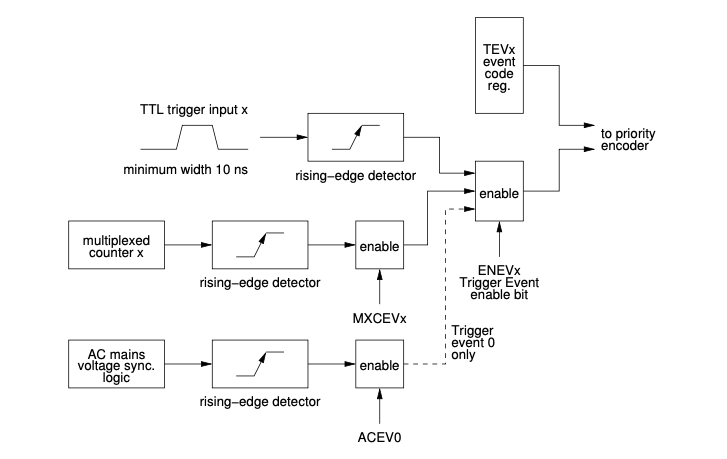

#### Event Sequencer

Event sequencers provide a method of transmitting or playing back
sequences of events stored in random access memory with defined timing.
In the event generator there are two event sequencers. 8-bit event codes
are stored in a RAM table each attached with a 32-bit timestamp (event
address) relative to the start of sequence. Both sequencers can hold up
to 2048 event code -- timestamp pairs.

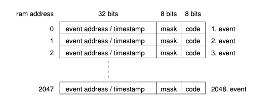

Sequencer RAM Structure


The sequencer runs at the event clock rate. When the sequencer is
triggered the internal event address counter starts counting. The
counter value is compared to the event address of the next event in the
RAM table. When the counter value matches or is greater than the
timestamp in the RAM table, the attached event code is transmitted.

The time offset between two consecutive events in the RAM is allowed to
be 1 to 2{sup}`32` sequence clock cycles i.e. the internal event address
counter rolls over to 0 when 0xffffffff is reached.

Starting with firmware version 0200 a mask field has been added. Bits in
the mask field allow masking events from being send out based on
external signal input states or software mask bits.

The Sequencers may be triggered from several sources including software
triggering, triggering on a multiplexed counter output or AC mains
voltage synchronization logic output.

The sequencer has three operating modes: single sequence, recycle and
recycle with re-trigger (retrigger).

In the **single sequence** mode, the sequencer runs through the table
until it reaches the end sequence code. After that, the sequencer is
disabled, the timestamp (event address) counter and the RAM address are
reset. The sequencer has to be re-enabled before it can run again.

In **recycle** mode, the sequence runs again immediately when it reaches
the end sequence code. The sequencer then restarts from the beginning of
the RAM.

In the **retrigger** mode, the sequencer stops when it reaches the end
sequence code and waits for a trigger. RAM address and timestamp counter
are both reset. When a new trigger arrives, the sequencer starts a new
run. The difference to the single sequence mode is that the sequencer
does not get disabled at end of sequence.

The sequencers are enabled by writing a '1' bit to SQxEN in the Sequence
RAM control Register. The RAMs may be disabled any time by writing a '1'
to SQxDIS bit. Disabling sequence RAMs does not reset the RAM address
and timestamp registers. By writing a '1' to the bit SQxRES in the
Control Register the sequencer is both disabled and the RAM address and
timestamp register is reset.

The contents of a sequencer RAM may be altered at any time, however, it
is recommended only to modify RAM contents when the RAM is disabled.

There are two special event codes which are not transmitted, the null
event code 0x00 and end sequence code 0x7f.

The null event code may be used if the time between two consecutive
events should exceed 2{sup}`32` event clock cycles by inserting a null event
with a timestamp value of 0xffffffff. In this case the sequencer time
will roll over from 0xffffffff to 0x00000000.

The end sequence code resets the sequencer RAM table address and
timestamp register and depending on configuration bits, disables the
sequencer (single sequence, SQxSNG=1) or restarts the sequence either
immediately (recycle sequence, SQxREC=1) or waits for a new trigger
(SQxREC=0).

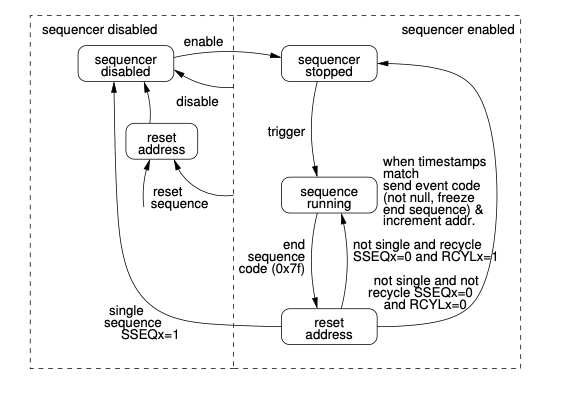

#### Sequencer Interrupt Support

The sequencers provide several interrupts: a sequence start and sequence
stop interrupt and two interrupts based on the position of the
playback pointer in the sequencer RAM: a sequence halfway through
interrupt and a sequence roll-over interrupt. The sequence start
interrupt is issued when a sequencer is in enabled state, gets triggered
and was not running before the trigger. A sequence stop interrupt is
issued when the sequence is running and reaches the 'end of sequence'
code.

#### Uses for the sequencer 

The event sequencers are typically used for sending out a precisely
timed sequence of events, like an accelerator machine cycle. 
In this case, event codes that have been defined for different actions to
be taken during the acceleration cycle are placed in the sequencer RAM 
together with the time interval (event address) between sending out the events.
This is the most common use case for the sequencers. Typically the two sequencers
are used in foreground/background combination, where the foreground sequencer is 
transmitting events, and the background sequencer can be prepared by software 
for the upcoming cycles. When the foreground sequencer finishes, the roles can
be swapped and the backgound sequencer made active.

A more exotic use case for the sequencer could be sending out a complicated 
signal pattern, using the RAM contents in the recycle mode.

#### Software-generated Events

Events can be generated in software by writing into the Software Event register.
This is useful for creating events that occur based on some higher-level conditions;
for example an operator requesting a beam dump in a circular accelerator. 

#### Upstream Events

Event Generators may be cascaded. The bitstream receiver in the event generator includes
a first-in-first-out (FIFO) memory to synchronize incoming events which
may be synchronized to a clock unrelated to the event clock. Usually
there are no events in the FIFO. An event code from an upstream EVG is
transmitted as soon as there is no other event code to be transmitted.

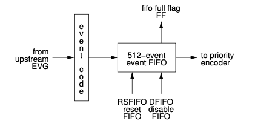

Figure: Upstream event processing.

(distributed-bus)=
### Distributed Bus

The distributed bus allows transmission of eight simultaneous signals
with half of the event clock rate time resolution (20 ns at 100 MHz
event clock rate) from the event generator to the event receivers.

```{note} Hard/firmware before Delay Compensation
:class: dropdown

Before introduction of delay compensation, if the data transfer feature was not in use,
the highest time resolution for the distributed bus bits was equal to ßthe event clock rate.
```

The source for distributed bus signals may be an external source 
or the signals may be generated with programmable [multiplexed counters](#mpx-counters) (MXC) 
inside the event generator. 
The bits of the distributed bus from external signals are sampled synchronously to the event clock. 

The distributed bus signals can be programmed 
to be available as hardware outputs on the event receiver. 

If there is an upstream EVG, the state of all distributed bus bits may be forwarded by the EVG.

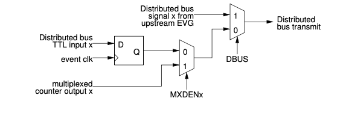

Figure: Distributed Bus signal source selection.

(timestamp-support)=
### Timestamping support

The event system supports timestamping by providing:
  - Facilities to distribute a seconds value to all receivers
  - Facilities to support generation of sub-second timestamps, usually in the event clock resolution
  - Precisely latching the timestamp in an Event Receiver, on request or when an event code has been received.

The timestamp support guarantees that all event receivers (and generators) in the same distribution will have
precisely synchronized timestamp, up to the resolution of the event clock. For example, 100 MHz event clock results 
in highest timestamp resolution of 10 nanoseconds.

The seconds value to be distributed has to be provided to the Event Generator. 
This is typically sourced from an external GPS receiver. 

#### Timestamp Generator

The model of time implemented by the MRF hardware is two 32-bit unsigned
integers: counter, and "seconds". The counter is maintained by each EVR
and incremented quickly. The value of the "seconds" is sent periodically
from the EVG at a lower rate.

During each "second" 33 special codes (see sec.
[Event Codes](#event-codes))
must be sent. The first 32 are the shift 0/1 codes which contain the
value of the next "second". The last is the timestamp reset event. When
received this code transfers the new "second" value out of the shift
register, and resets the counter to zero. These actions start the next
"second".

Note that while it is referred to as "seconds" this value is an
arbitrary integer which can have other meanings. Currently only one time
model is implemented, but implementing others is possible.

#### Standard (aka "Light Source") Time Model

In this model the "seconds" value is an actual 1Hz counter. The software
default is the POSIX time of seconds since 1 Jan. 1970 UTC. Each new
second is started with a trigger from an external 1Hz oscillator,
usually a GPS receiver. Most GPS receivers have a one pulse per second
(PPS) output. Time is converted to the EPICS epoch (1 Jan. 1990) for use
in the IOC.

Several methods of sending the seconds value to the EVG are possible:

#### External hardware

In this method, hardware is used to communicate with a GPS
receiver over a serial (RS232) link to receive the timestamp and
connect to two external inputs on the EVG. These inputs must be
programmed to send the shift 0/1 codes.

#### Time from an NTP server

Time from a NTP server can be used without special hardware. This requires only a 1Hz (PPS)
signal coming from the same source as the NTP time. Several commerial
vendors supply dedicated NTP servers with builtin GPS receivers and 1Hz
outputs. A software function is provided on the EVG which is triggered
by the 1Hz signal. At the start of each second it sends the next second
(current+1), which will be latched after the following 1Hz tick.


#### Timestamping Inputs

Starting from firmware version E306 a few distributed bus input signals
have dual function: transition board input DBUS5-7 can be used to
generate special event codes controlling the timestamping in Event
Receivers.

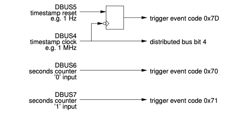

The two clocks, timestamp clock and timestamp reset clock, are assumed
to be rising edge aligned. In the EVG the timestamp reset clock is
sampled with the falling edge of the timestamp clock. This is to prevent
a race condition between the reset and clock signals. In the EVR the
reset is synchronised with the timestamp clock.

The two seconds counter events are used to shift in a 32-bit seconds
value between consecutive timestamp reset events. In the EVR the value
of the seconds shift register is transferred to the seconds counter at
the same time the higher running part of the timestamp counter is reset.

Logic has been added to automatically increment and send out the 32-bit
seconds value. Using this feature requires the two externally supplied
clocks as shown above, but the events 0x70 and 0x71 get generated
automatically.

After the rising edge of the slower clock on DBUS4, the internal seconds
counter is incremented and the 32 bit binary value is sent out LSB first
as 32 events 0x70 and 0x71. The seconds counter can be updated by
software by using the `TSValue` and `TSControl` registers.

The distributed bus event inputs can be enabled independently through
the distributed bus event enable register. The events generated through
these distributed bus input ports are given lowest priority.


(synchronous-data)=
### Configurable Size Data Buffer

A buffer of up to 2k bytes can be transmitted over the event link. This data buffer will be 
(synchronously) available to all EVRs that receive the event stream.

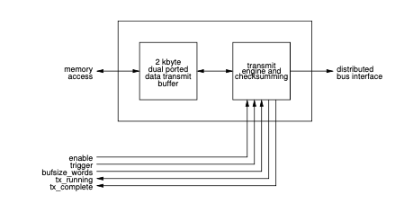

The data to be transmitted is stored in a 2 kbyte dual-ported memory
starting from the lowest address 0. This memory is directly accessible
via the memory interface. 

The transfer size is determined by bufsize register bits in
four byte increments. The transmission is triggered by software. Two
flags tx_running and tx_complete represent the status of transmission.
Transmission utilises two K-characters to mark the start and end of the
data transfer payload, the protocol looks following:

| **8B10B-character** | **Description** |
|-----------------    | --------------- |
|  K28.0             | Start of data transfer |
|  Dxx.x             | 1st data byte (address 0) |
|  Dxx.x             | 2nd data byte (address 1) |
|  Dxx.x             | 3rd data byte (address 2) |
|  Dxx.x             | 4th data byte (address 3) |
|  \...              | \... |
|  Dxx.x             | n{sup}`th` data byte (address n-1) |
|  K28.1             | End of data |
|  Dxx.x             | Checksum (MSB) |
|  Dxx.x             | Checksum(LSB) |

#### Segmented Data Buffer Transmission

In addition to the configurable size data buffer a new way to transfer
information is provided. The segmented data buffer memory is divided into
128 segments of 16 bytes each and it is possible to transmit the
contents of a single segment or a block of consecutive segments without
affecting contents of other segments.

With the introduction of active delay compensation in 
firmware version 0200,  the use of the "data buffer mode"
has become mandatory. The active delay compensation logic does use the last segment of the
segmented data buffer memory for propagating delay compensation
information and this segment is reserved for system use.

The data to be transmitted is stored in a 2 kbyte dual-ported memory
starting from the lowest address 0. This memory is directly accessible
from the memory interface (VME, PCI). The transfer size is determined by bufsize register bits in
four byte increments. The transmission is triggered by software. Two
flags, `tx_running` and `tx_complete` represent the status of transmission.

Transmission utilises two K-characters to mark the start and end of the
data transfer payload, the protocol looks following:


| **8B10B-character** | **Description** |
|-----------------    | --------------- |
| K28.2               |Start of data transfer |
|  Dxx.x              | Block address of 16 byte segment |
|  Dxx.x              | 1st data byte (address 0) |
|  Dxx.x              | 2nd data byte (address 1) |
|  Dxx.x              | 3rd data byte (address 2) |
|  Dxx.x              | 4th data byte (address 3) |
|  \...               | \... |
|  Dxx.x              | nth data byte (address n-1) |
|  K28.1              | End of data |
|  Dxx.x              | Checksum (MSB) |
|  Dxx.x              | Checksum(LSB) |

Segmented Data Transfer Example

#### Delay Compensation and Topology ID data

The last segment is reserved for system management and is used to
propagate delay compensation and topology data. The contents of the last
segment are represented below. Please note that the word values are in
little endian byte order.

| segment |  byte 0 - 3 |  byte 4 - 7 |  byte 8 - 11 |  byte 12 - 15 |
| ------- | ----------- | ----------- | ------------ | ------------- |
|   127   |  DCDelay    |  DCStatus   |  reserved    |  TopologyID   |

**DCDelay** represents the delay from DC master to receiving node. The
value is a fixed point number with the point between the two 16 bit
words. The delay is measured in event clock cycles.

**DCStatus** shows the quality of the delay value: 1 - initial lock, 3 -
locked with precision \< event clock cycle, 7 - fine precision.

**TopologyID** shows the geographical address of the node.

### Programmable Outputs

All the outputs are programmable: multiplexed counters and distributed
bus bits can be mapped to any output. The mapping is shown in table
below.

 | MappingID   | Signal |
 | ----------- | ------------ |
 | 0 to 31     | (Reserved) |
 | 32          | Distributed bus bit 0 (DBUS0) |
 | \...        | \... |
 | 39          | Distributed bus bit 7 (DBUS7) |
 | 40          | Multiplexed Counter 0 |
 | \...        | \... |
 | 47          | Multiplexed Counter 7 |
 | 48          | AC trigger logic output |
 | 49 to 61    | (Reserved) |
 | 62          | Force output high (logic 1) |
 | 63          | Force output low (logic 0) |

### Utility Functions in the Event Generator

(mpx-counters)=
#### Multiplexed Counters

Eight 32-bit multiplexed counters generate clock signals with
programmable frequencies from event clock/2{sup}`32`−1 to event clock/2.
Even divisors create 50% duty cycle signals. The counter outputs may be
programmed to trigger events, drive distributed bus signals and trigger
sequence RAMs. The output of multiplexed counter 7 is hard-wired to the
mains voltage synchronization logic.

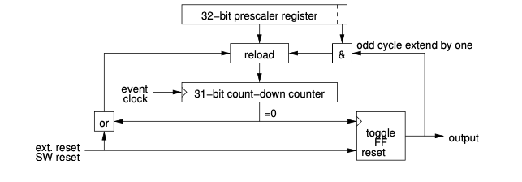

Each multiplexed counter consists of a 32-bit prescaler register and a
31-bit count-down counter which runs at the event clock rate. When count
reaches zero, the output of a toggle flip-flop changes and the counter
is reloaded from the prescaler register. If the least significant bit of
the prescaler register is one, all odd cycles are extended by one clock
cycle to support odd dividers. The multiplexed counters may be reset by
software or hardware input. The reset state is defined by the
multiplexed counter polarity register.

| **Prescaler value** | **DutyCycle** | **Frequency at 125MHz Event Clock** |
| ------------------- | ------------- | ----------------------------------- |
| 0,1 not allowed | undefined | undefined |
| 2 | 50/50 | 62.5 MHz |
| 3 | 33/66 | 41.7 MHz |
| 4 | 50/50 | 31.25 MHz |
| 5 | 40/60 | 25 MHz |
| ... | ... | ... |
| 2{sup}`32`−1 | approx. 50/50 | 0.029 Hz |

#### AC Line Synchronisation

The Event Generator provides synchronization to the mains voltage
frequency or another external clock. The mains voltage frequency can be
divided by an eight bit programmable divider. The output of the divider
may be delayed by 0 to 25.5 ms by a phase shifter in 0.1 ms steps to be
able to adjust the triggering position relative to mains voltage phase.
After this the signal synchronized to the event clock or the output of
multiplexed counter 7. The option to synchronize to an external clock
provided in front panel TTL input IN1 or IN2 has been added in firmware
version 22000207.

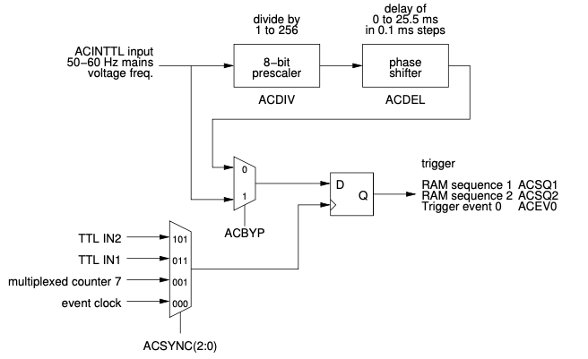

The phase shifter operates with a clock of 1 MHz which introduces
jitter. If the prescaler and phase shifter are not required this circuit
may be bypassed. This also reduces jitter because the external trigger
input is sampled directly with the event clock.

#### Front Panel TTL Input with Phase Monitoring

Starting from firmware 22000207 a new phase select and phase monitoring
feature for the front panel TTL inputs has been added. This allows for
monitoring the signal phase and selecting the sampling point of external
signals that are phase locked to the event clock.

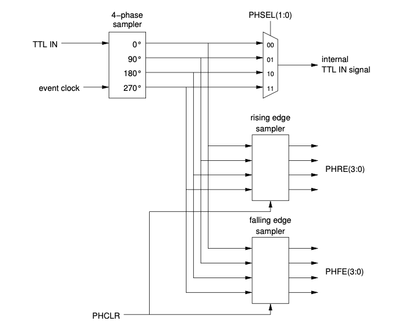

The external signal is sampled with four phases of the event clock, 0°,
90°, 180° and 270° and synchronized to the event clock. The signal being
used for the internal FPGA logic is selected by the PHSEL bits in the
phase monitoring register.

The phase monitoring logic detects rising and falling edges of the
incoming signal and stores the phase offset in two registers PHRE for
the rising edge and PHFE for the falling edge. The contents of the
registers are updated on each edge detected and the values can be reset
to 0000 for PHRE and 1111 for PHFE by writing a '1' to the PHCLR bit.

If the input signal is phase locked to the event clock the phase
monitoring values should be stable or toggling between two values if the
signal is close to the clock sampling edge. A sampling point as far as
possible from the transition point should be selected. Selecting the
correct edge is not automated. The edge position of interest should be
monitored by the user application and the correct phase should be
selected by software.

In the DC firmware the distributed bus is operating at half rate of the
event clock and when using an external clock with an even sub-harmonic
the phase of the distributed bus transmission is arbitrary after
restarting the system. To overcome this the phase monitoring inputs have
a status bit that shows the phase of the distributed bus on the rising
edge of the external input. The user can monitor this bit and verify
that the phase is correct each time the system is restarted. If the
phase is incorrect the phase may be toggled by writing a '1' into the
PHTOGG bit in the clock control register.

### Event Clock RF Source

All operations on the event generator are synchronised to the event
clock which is derived from an externally provided RF clock. For
laboratory testing purposes an on-board fractional synthesiser may be
used to deliver the event clock. The serial link bit rate is 20 times
the event clock rate. The acceptable range for the event clock and bit
rate is shown in the following table.

During operation the reference frequency should not be changed more than
±100 ppm.

|    | EventClock | BitRate | 
| -- | ---------- | ------- |
| Minimum | 50 MHz    | 1.0 Gb/s |
| Maximum | 142.8 MHz | 2.9 Gb/s |

#### RF Clock and Event Clock 

The event clock may be derived from an external
RF clock signal. The front panel RF input is 50 ohm terminated and AC
coupled to a [LVPECL logic](https://en.wikipedia.org/wiki/Emitter-coupled_logic#PECL) input, so either an ECL level clock signal or
sine-wave signal with a level of maximum +10 dBm can be used.

| Divider | RF Input Frequency | Event Clock | Bit Rate |
| ------- | ------------------ | ----------- | -------- |
| ÷1 | 50 MHz – 142.8 MHz  | 50 MHz–142.8 MHz | 1.0 Gb/s – 2.9 Gb/s |
| ÷2 | 100 MHz – 285.6 MHz | 50 MHz–142.8 MHz | 1.0 Gb/s – 2.9 Gb/s |
| ÷3 | 150 MHz – 428.4 MHz | 50 MHz–142.8 MHz | 1.0 Gb/s – 2.9 Gb/s |
| ÷4 | 200 MHz – 571.2 MHz | 50 MHz–142.8 MHz | 1.0 Gb/s – 2.9 Gb/s |
| ÷5 | 250 MHz – 714 MHz   | 50 MHz–142.8 MHz | 1.0 Gb/s – 2.9 Gb/s |
| ÷6 | 300 MHz – 856.8 MHz | 50 MHz–142.8 MHz | 1.0 Gb/s – 2.9 Gb/s |
| ÷7 | 350 MHz – 999.6 MHz | 50 MHz–142.8 MHz | 1.0 Gb/s – 2.9 Gb/s |
| ÷8 | 400 MHz – 1.142 GHz | 50 MHz–142.8 MHz | 1.0 Gb/s – 2.9 Gb/s |
| ÷9 | 450 MHz – 1.285 MHz | 50 MHz–142.8 MHz | 1.0 Gb/s – 2.9 Gb/s |
| ÷10 | 500MHz–1.428GHz    | 50 MHz–142.8 MHz | 1.0 Gb/s – 2.9 Gb/s |
| ÷11 | 550MHz–1.571GHz    | 50 MHz–142.8 MHz | 1.0 Gb/s – 2.9 Gb/s |
| ÷12 | 600 MHz – 1.6 GHz  | 50 MHz–133  MHz | 1.0 Gb/s – 2.667 Gb/s |
| ÷14 | 700MHz–1.6GHz *)   | 50 MHz–114 MHz | 1.0 Gb/s – 2.286 Gb/s |
| ÷15 | 750MHz–1.6GHz *)   | 50 MHz–107 MHz | 1.0 Gb/s – 2.133 Gb/s |
| ÷16 | 800MHz–1.6GHz *)   | 50 MHz–100 MHz | 1.0 Gb/s – 2.0 Gb/s |
| ÷17 | 850MHz–1.6GHz *)   | 50 MHz–94 MHz | 1.0 Gb/s – 1.882 Gb/s |
| ÷18 | 900MHz–1.6GHz *)   | 50 MHz–88 MHz | 1.0 Gb/s – 1.777 Gb/s |
| ÷19 | 950MHz–1.6GHz *)   | 50 MHz–84 MHz | 1.0 Gb/s – 1.684 Gb/s |
| ÷20 | 1.0GHz–1.6GHz *)   | 50 MHz–80 MHz | 1.0 Gb/s – 1.600 Gb/s |
| ÷21 | 1.05GHz–1.6GHz *)  | 50 MHz–76 MHz | 1.0 Gb/s – 1.523 Gb/s |
| ÷22 | 1.1GHz–1.6GHz  *)  | 50 MHz–72 MHz | 1.0 Gb/s – 1.454 Gb/s |
| ÷23 | 1.15GHz–1.6GHz *)  | 50 MHz–69 MHz | 1.0 Gb/s – 1.391 Gb/s |
| ÷24 | 1.2GHz–1.6GHz  *)  | 50 MHz–66 MHz | 1.0 Gb/s – 1.333 Gb/s |
| ÷25 | 1.25GHz–1.6GHz *)  | 50 MHz–64 MHz | 1.0 Gb/s – 1.280 Gb/s |
| ÷26 | 1.3GHz–1.6GHz  *)  | 50 MHz–61 MHz | 1.0 Gb/s – 1.230 Gb/s |
| ÷27 | 1.35GHz–1.6GHz *)  | 50 MHz–59 MHz | 1.0 Gb/s – 1.185 Gb/s |
| ÷28 | 1.4GHz–1.6GHz  *)  | 50 MHz–57 MHz | 1.0 Gb/s – 1.142 Gb/s |
| ÷29 | 1.45GHz–1.6GHz *)  | 50 MHz–55 MHz | 1.0 Gb/s – 1.103 Gb/s |
| ÷30 | 1.5GHz–1.6GHz  *)  | 50 MHz–53 MHz | 1.0 Gb/s – 1.066 Gb/s |
| ÷31 | 1.55GHz–1.6GHz *)  | 50 MHz–51 MHz | 1.0 Gb/s – 1.032 Gb/s |
| ÷32 | 1.6 GHz       *)   | 50 MHz | 1.0 Gb/s |

RF Input Requirements

*) Range limited by AD9515 maximum input frequency of 1.6 GHz

#### Fractional Synthesiser (EVM, distribution layer)

The event master requires a reference clock to be able to synchronise on
the incoming event stream sent by the system master. A Micrel
(<http://www.micrel.com>) SY87739L Protocol Transparent Fractional-N
Synthesiser with a reference clock of 24 MHz is used. 

The following table lists programming bit patterns for a few frequencies. 
Please note that before programming a new operating frequency in the fractional
synthesizer the operating frequency (in MHz) has to be set in the
UsecDivider register. This is essential as the board's PLL cannot lock
if it does not know the frequency range to lock to.


|Event Rate                   | Configuration Bit Pattern | Reference Output | Precision (theoretical)|
|---------------------------  | ------------------------  | ---------------- | ---------------------- |
|142.8 MHz                    | 0x0891C100                | 142.857 MHz      | 0
|499.8 MHz/4 = 124.95 MHz     | 0x00FE816D                | 124.95 MHz       | 0
|499.654 MHz/4 = 124.9135 MHz | 0x0C928166                | 124.907 MHz      | -52 ppm
|476 MHz/4 = 119 MHz          | 0x018741AD                | 119 MHz          | 0
|106.25 MHz (fibre channel)   | 0x049E81AD                | 106.25 MHz       | 0
|499.8 MHz/5 = 99.96 MHz      | 0x025B41ED                | 99.956 MHz       | -40 ppm
|50 MHz                       | 0x009743AD                | 50.0 MHz         | 0
|499.8 MHz/10 = 49.98 MHz     | 0x025B43AD                | 49.978 MHz       | -40 ppm
|499.654MHz/4=124.9135MHz     | 0x0C928166                | 124.907MHz       | -52 ppm
|50 MHz                       | 0x009743AD                | 50.0 MHz         | 0

## Event Receiver

Event Receivers decode timing events and signals from an optical event
stream transmitted by an Event Generator. Events and signals are
received at predefined rate the event clock that is usually divided down
from an accelerators main RF reference. The event receivers lock to the
phase event clock of the Event Generator and are thus phase locked to
the RF reference. Event Receivers convert event codes transmitted by an
Event Generator to hardware outputs. They can also generate software
interrupts and store the event codes with globally distributed
timestamps into FIFO memory to be read by a CPU.

### Functional Description

After recovering the event clock the Event Receiver demultiplexes the
event stream to  8-bit event codes and 8-bit distributed bus data. The
distributed bus may be configured to share its bandwidth with time
deterministic data transmission.

### Event Decoding

The Event Receiver provides two mapping RAMs of 256 × 128 bits. Only one
of the RAMs can be active at a time, however both RAMs may be modified
at any time. he event code is applied to the address lines of the active
mapping RAM. The 128-bit data programmed into a specific memory location
pointed to by the event code determines what actions will be taken.

| Event code   | Offset | Internal functions | Pulse Triggers   | 'Set' Pulse  | 'Reset' Pulse |
| ----------   | ------ | ------------------ | --------------   | -----------  | ------------- | 
| > 0x00   | 0x0000 | 4 bytes/32 bits | 4 bytes/32 bits | 4 bytes/32 bits | 4 bytes/32 bits    |
| > 0x01   | 0x0010 | 4 bytes/32 bits | 4 bytes/32 bits | 4 bytes/32 bits | 4 bytes/32 bits    |
| > 0x02   | 0x0020 | 4 bytes/32 bits | 4 bytes/32 bits | 4 bytes/32 bits | 4 bytes/32 bits    |
| > \...   | > \... | > \...   | > \...   | > \...   | > \...   |
| > 0xFF   | 0x0FF0 | 4 bytes/32 bits | 4 bytes/32 bits | 4 bytes/32 bits | 4 bytes/32 bits    |

There are 32 bits (96 to 127) that are reserved for internal functions, some of which are by default
mapped to the event codes shown in the table below. 
The remaining 96 bits control internal pulse generators. For each pulse generator there is 
one bit to trigger the pulse generator, one bit to set the pulse generator output
and one bit to clear the pulse generator output.

| Map bit    | Default event code | Function                                     |
| -------    | ------------------ | -------------------------------------------  |
| 127        | n/a                | Save event in FIFO                           |
| 126        | n/a                | Latch timestamp                              |
| 125        | n/a                | Led event                                    |
| 124        | n/a                | Forward event from RX to TX                  |
| 123        | 0x79               | Stop event log                               |
| 122        | n/a                | Log event                                    |
| 102 to 121 | n/a                | (Reserved)                                   |
| 101        | 0x7a               | Heartbeat event                              |
| 100        | 0x7b               | Reset Prescalers                             |
| 99         | 0x7d               | Timestamp reset event (TS counter reset)     |
| 98         | 0x7c               | Timestamp clock event (TS counter increment) |
| 97         | 0x71               | Seconds shift register '1'                   |
| 96         | 0x70               | Seconds shift register '0'                   |
| 80 to 95   | n/a                | (Reserved)                                   |
| 79         | n/a                | Trigger pulse generator 15                   |
| ...        | n/a |
| 64         | n/a                | Trigger pulse generator 0                    |
| 48 to 63   | n/a                | (Reserved)                                   |
| 47         | n/a                | Set pulse generator 15 output high           |
| ...        | n/a |
| 32         | n/a                | Set pulse generator 0 output high            |
| 16 to 31   | n/a                | (Reserved)                                   |
|      15    | n/a                | Reset pulse generator 15 output low          |
| ...        | n/a |
| 0          | n/a                | Reset pulse generator 0 output low           |

### Heartbeat Monitor

A heartbeat monitor is provided to receive heartbeat events. Event code
\$7A is by default set up to reset the heartbeat counter. If no
heartbeat event is received the counter times out (approx. 1.6 s) and a
heartbeat flag is set. The Event Receiver may be programmed to generate
a heartbeat interrupt at timeout.

### Event FIFO and Timestamp Events

The Event System provides a global timebase to attach timestamps to
collected data and performed actions. The time stamping system consists
of a 32-bit timestamp event counter and a 32-bit seconds counter. The
timestamp event counter either counts received timestamp counter clock
events or runs freely with a clock derived from the event clock. The
event counter is also able to run on a clock provided on a distributed
bus bit.

The event counter clock source is determined by the prescaler control
register. The timestamp event counter is cleared at the next event
counter rising clock edge after receiving a timestamp event counter
reset event. The seconds counter is updated serially by loading zeros
and ones (see mapping register bits) into a shift register MSB first.
The seconds register is updated from the shift register at the same time
the timestamp event counter is reset.

The timestamp event counter and seconds counter contents may be latched
into a timestamp latch. Latching is determined by the active event map
RAM and may be enabled for any event code. An event FIFO memory is
implemented to store selected event codes with attached timing
information. The 80-bit wide FIFO can hold up to 511 events. The
recorded event is stored along with 32-bit seconds counter contents and
32-bit timestamp event counter contents at the time of reception. The
event FIFO as well as the timestamp counter and latch are accessible by
software.

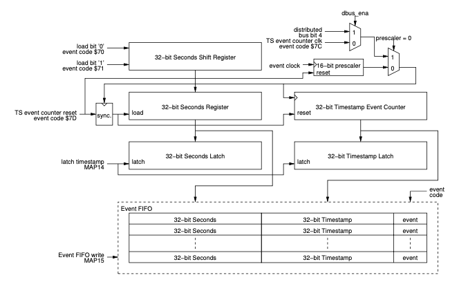

### Event Log

Up to 512 events with timestamping information can be stored in the
event log. The log is implemented as a ring buffer and is accessible as
a memory region. Logging events can be stopped by an event or software.

### Distributed Bus and Data Transmission

The distributed bus is able to carry eight simultaneous signals sampled
with half the event clock rate over the fibre optic transmission media.
The distributed bus signals may be output on programmable front panel
outputs. The distributed bus bandwidth is shared by transmission of a
configurable size data buffer to up to 2 kbytes.

### Pulse Generators

The structure of the pulse generation logic is shown in the figure
below. Three signals from the mapping RAM control the output of the
pulse: trigger, 'set' pulse and 'reset' pulse. A trigger causes the
delay counter to start counting, when the end-of-count is reached the
output pulse changes to the 'set' state and the width counter starts
counting. At the end of the width count the output pulse is cleared. The
mapping RAM signal 'set' and 'reset' cause the output to change state
immediately without any delay.

Starting from firmware version 0200 pulse generators can also be
triggered from rising edges of distributed bus signals or EVR internal
prescalers.

32 bit registers are reserved for both counters and the prescaler,
however, the prescaler is not necessarily implemented for all channels
and may be hard coded to 1 in case the prescaler is omitted. Software
may write 0xFFFFFFFF to these registers and read out the actual width or
hard-coded value of the register. For example, if the width counter is
limited to 16 bits a read will return 0x0000FFFF after a write of
0xFFFFFFFF.

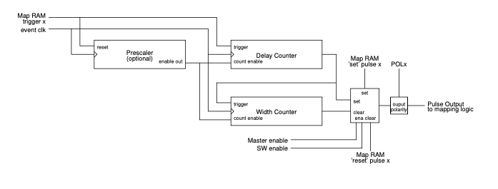

Pulse Generator

Depending on firmware revision/form factor a number of pulse generators
are configured as event triggered gates only and can be used to mask or
enable pulse generator triggers.

The VME-EVR-300, PCIe-EVR- 300DC and mTCA-EVR-300 have four pulse
generators configured as gates, pulse generators 28 to 31 which
correspond gates 0 to 3.

### Prescalers

The Event Receiver provides a number of programmable prescalers. The
frequencies are programmable and are derived from the event clock. A
special event code reset prescalers \$7B causes the prescalers to be
synchronously reset, so the frequency outputs will be in same phase
across all event receivers.

### Programmable Front Panel, Universal I/O and Backplane Connections

All outputs are programmable: each pulse generator output, prescaler and
distributed bus bit can be mapped to any output. Starting with firmware
version 0200 each output can have two sources which are logically OR'ed
together. The mapping for a single source is shown in table below.

Each output has a two byte mapping register and each byte corresponds a
single source. An unused mapping source should be set to 63 (0x3f). In
case of a bidirectional signal to tri-state set both bytes to 61 (0x3d).

Table 18: Output mapping values

  | Mapping ID  |  Signal                                                                                            |
  |------------ | ---------------------------------------------------------------------------------------------------|
  | 0 to n-1    |  Pulse generator output (number n of pulse generators depends on HW and firmware version)
  | n to 31     |  (Reserved)
  | 32          |  Distributed bus bit 0 (DBUS0)
  | \...        |  \...
  | 39          |  Distributed bus bit 7 (DBUS7)
  | 40          |  Prescaler 0
  | 41          |  Prescaler 1
  | 42          |  Prescaler 2
  | 43 to 47    |  (Reserved)
  | 48          |  Flip-flop output 0
  | \...        |  \...
  | 55          |  Flip-flop output 7
  | 56 to 58    |  (Reserved)
  | 59          |  Event clock output (only on PXIe-EVR-300)
  | 60          |  Event clock output with 180° phase shift (only on PXIe-EVR-300)
  | 61          |  Tri-state output (for PCIe-EVR-300DC with input module populated in IFB-300's Universal I/O slot)
  | 62          |  Force output high (logic 1)
  | 63          |  Force output low (logic 0)
 
### Flip-flop Outputs (from FW version 0E0207)

There are 8 flip-flop outputs. Each of these is using two pulse
generators, one for setting the output high and the other one for
resetting the output low. In the table below you can see the
relationship between flip-flops and pulse generators and the output
mapping IDs.

  | flip-flop   | mappingID   |Set          | Reset
  | ----------- | ----------- |------------ | ------------------
  | 0           | 48          |Pulse gen.   | 0 Pulse gen. 1
  | 1           | 49          |Pulse gen.   | 2 Pulse gen. 3
  | 2           | 50          |Pulse gen.   | 4 Pulse gen. 5
  | 3           | 51          |Pulse gen.   | 6 Pulse gen. 7
  | 4           | 52          |Pulse gen.   | 8 Pulse gen. 9
  | 5           | 53          |Pulse gen.   | 10 Pulse gen. 11
  | 6           | 54          |Pulse gen.   | 12 Pulse gen. 13
  | 7           | 55          |Pulse gen.   | 14 Pulse gen. 15

### Front Panel Universal I/O Slots

Universal I/O slots provide different types of output with exchangeable
Universal I/O modules. Each module provides two outputs e.g. two TTL
output, two NIM output or two optical outputs. The source for these
outputs is selected with mapping registers.

VME-EVR-300 GTX Front Panel Outputs and mTCA-EVR TCLKA/TCLKB Clocks The
VME-EVR-300 has four GTX front panel outputs, two in Universal I/O slot
UNIV6/UNIV7 and CML outputs CML0 and CML1. The GTX Outputs provide low
jitter signals with special outputs. The outputs can work in different
configurations: pulse mode, pattern mode and frequency mode. The
difference com- pared to the CML output of the VME-EVR-230RF is that
instead of 20 bits per event clock cycle the GTX outputs have 40 bits
per event clock cycle doubling the resolution to 200 ps/bit at an event
clock of 125 MHz. The mTCA-EVR-300 TCLKA and TCLKB backplane clock
operate the same way as VME-EVR-300 GTX front panel outputs. The pulse
mapping is controlled through UNIV16 (TCLKA) and UNIV17 (TCLKB) mapping
registers.

### GTX Pulse Mode

The source for these outputs is selected in a similar way than the
standard outputs using mapping registers, however, the output logic
monitors the state of this signal and distinguishes between state low
(00), rising edge (01), high state (11) and falling edge (10). Based on
the state a 40 bit pattern is sent out with a bit rate of 40 times the
event clock rate.

-   When the source for a GTX output is low and was low one event clock
    cycle earlier (state low), the GTX output repeats the 40 bit pattern
    stored in pattern_00 register.
-   When the source for a GTX output is high and was low one event clock
    cycle earlier (state rising), the GTX output sends out the 40 bit
    pattern stored in pattern_01 register.
-   When the source for a GTX output is high and was high one event
    clock cycle earlier (state high), the GTX output repeats the 40 bit
    pattern stored in pattern_11 register.
-   When the source for a GTX output is low and was high one event clock
    cycle earlier (state falling), the GTX output sends out the 40 bit
    pattern stored in pattern_10 register.

For an event clock of 125 MHz the duration of one single GTX output bit
is 200 ps. These outputs allow for producing fine grained adjustable
output pulses and clock frequencies.

### GTX Frequency Mode

In frequency mode one can generate clocks where the clock period can be
defined in steps of 1/40th part of the event clock cycle i.e. 200 ps
step with an event clock of 125 MHz. There are some limitations,
however:

> -   Clock high time and clock low time must be ≥ 40/40th event clock
>     period steps
> -   Clock high time and clock low time must be \< 65536/40th event
>     clock period steps

The clock output can be synchronized by one of the pulse generators,
distributed bus signal etc. When a rising edge of the mapped output
signal is detected the frequency generator takes its output value from
the trigger level bit and the counter value from the trigger position
register. Thus one can adjust the phase of the synchronized clock in
1/40th steps of the event clock period. To change the generated clock
phase in respect to the trigger we can select the trigger polarity by
bit CMLTL in the CML Control register and the trigger position also in
the CML Control register.

### GTX Pattern Mode

In pattern mode one can generate arbitrary bit patterns taking into account following:

:   -   The pattern length is a multiple of 40 bits, where each bit is
        1/40th of the event clock period
    -   Maximum length of the arbitrary pattern is 40 × 2048 bits
    -   A pattern can be triggered from any pulse generator, distributed
        bus bit etc. When triggered the pattern generator starts sending
        40 bit words from the pattern memory sequentially starting from
        position 0. This goes on until the pattern length set by the
        samples register has been reached.
    -   If the pattern generator is in recycle mode the pattern
        continues immediately from position 0 of the pattern memory.
    -   If the pattern generator is in single pattern mode, the pattern
        stops and the 40 bit word from the last position of the pattern
        memory (2047) is sent out until the pattern generator is
        triggered again.

### Configurable Size Data Buffer (EVR)

Pre-DC (Delay Compensation) event systems provided a way to to transmit
configurable size data packets that may be transmitted over the event
system link. The buffer transmission size is configured in the Event
Generator to up to 2 kbytes. The Event Receiver is able to receive
buffers of any size from 4 bytes to 2 kbytes in four byte (long word)
increments.

### Segmented Data Buffer

With the addition of delay compensation a segmented data buffer has been
introduced and it can coexist with the configurable size data buffer.
The segmented data buffer is divided into 16 byte segments that allow
updating only part of the buffer memory with the remaining segments left
untouched.

When starting a data transmission the Event Generator first sends the
starting segment number that defines the starting address in the buffer.
The data buffer address offset is the segment number \* 16 bytes. The
Event Receiver writes the received bytes into the data buffer and when
transmission is complete a receive complete flag is raised for the
starting segment of the packet transmission. The transmission can
overlap several segments, however, the flag is raised only for the
starting segment. If there is a checksum mismatch the checksum error
flag for the starting segment is set. In case the receive complete flag
already was set before the new data was received an segment overflow
flag is set. Flags are cleared by writing a '1' to the receive flag.
Each segment has a receive data counter and after completion of the
transfer the receive data counter of the starting segment is updated
with the actual number of bytes received in the transmission.

The procedure to receive a segmented data buffer is following:

:   -   check that receive complete flag for received segment is set
    -   check that starting segment overflow flag is cleared
    -   read transmission size from segment receive data counter
    -   copy segment data from segmented data buffer memory into system
        RAM • verify that starting segment overflow flag is still
        cleared
    -   clear segment receive complete flag

Starting with firmware 0205 the delay compensation logic uses the last
16 byte segment of the segmented data buffer for delay compensation
data.

### Interrupt Generation

The Event Receiver has multiple interrupt sources which all have their
own enable and flag bits. The following events may be programmed to
generate an interrupt:

> -   Receiver link state change
> -   Receiver violation: bit error or the loss of signal.
> -   Lost heartbeat: heartbeat monitor timeout.
> -   Write operation of an event to the event FIFO.
> -   Event FIFO is full.
> -   Data Buffer reception complete.

In addition to the events listed above an interrupt can be generated
from one of the pulse generator outputs, distributed bus bits or
prescalers. The pulse interrupt can be mapped in a similar way as the
front panel outputs.

### External Event Input

An external hardware input is provided to be able to take an external
pulse to generate an internal event. This event will be handled as any
other received event.

### Programmable Reference Clock

The event receiver requires a reference clock to be able to synchronise
on the incoming event stream sent by the event generator. For
flexibility a programmable reference clock is provided to allow the use
of the equipment in various applications with varying frequency
requirements. Please note before programming a new operating frequency
with the fractional synthesizer the operating frequency (in MHz) has to
be set in the UsecDivider register. This is essential as the event
receiver's PLL cannot lock if it does not know the frequency range to
lock to.

### Fractional Synthesiser

The clock reference for the event receiver is generated on-board the
event receiver using a fractional synthesiser. A Micrel
(<http://www.micrel.com>) SY87739L Protocol Transparent Fractional-N
Synthesiser with a reference clock of 24 MHz is used. The following
table lists programming bit patterns for a few frequencies.

  | Event Rate                     | Configuration Bit Pattern   | Reference Output   | Precision (theoretical)
  | ------------------------------ | --------------------------- | ------------------ | -------------------------
  | 142.8 MHz                      | 0x0891C100                  | 142.857 MHz        | 0
  | 499.8 MHz/4 = 124.95 MHz       | 0x00FE816D                  | 124.95 MHz         | 0
  | 499.654 MHz/4 = 124.9135 MHz   | 0x0C928166                  | 124.907 MHz        | -52 ppm
  | 476 MHz/4 = 119 MHz            | 0x018741AD                  | 119 MHz            | 0
  | 106.25 MHz (fibre channel)     | 0x049E81AD                  | 106.25 MHz         | 0
  | 499.8 MHz/5 = 99.96 MHz        | 0x025B41ED                  | 99.956 MHz         | -40 ppm
  | 50 MHz                         | 0x009743AD                  | 50.0 MHz           | 0
  | 499.8 MHz/10 = 49.98 MHz       | 0x025B43AD                  | 49.978 MHz         | -40 ppm
  | 499.654MHz/4=124.9135MHz       | 0x0C928166                  | 124.907MHz         | -52 ppm
  | 50 MHz                         | 0x009743AD                  | 50.0 MHz           | 0

The event receiver reference clock is required to be in ±100 ppm range
of the event generator event clock.

## Delay Compensation

With the active delay compensation feature the Event Generator and
distribution layer have been integrated into a single product, the Event
Master (EVM).

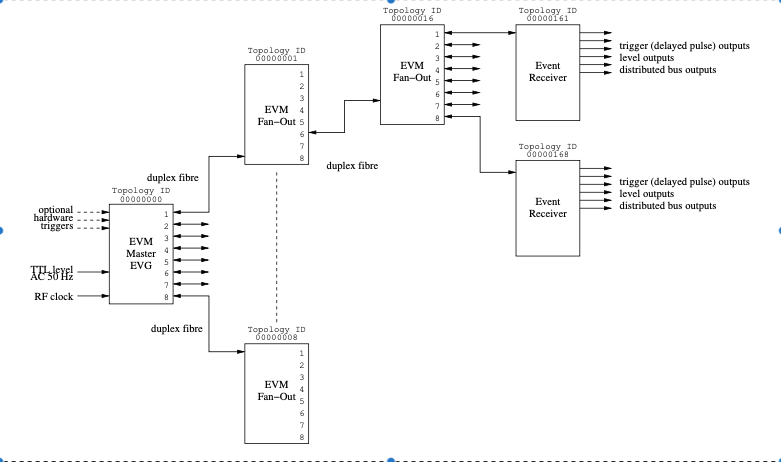

Figure 1: Timing System Topology (Active Delay Compensation, series 300)

### Topology ID

Each device in the timing system is given an unique identifier, the
Topology ID. The master EVM is given ID 0x00000000. The downstream
devices are given IDs with the least significant four bits representing
the port number the device is connected to. Each EVM left shifts its own
ID by four bits and assigns the downstream port number to the lowest
four bits to form the topology ID for the downstream devices in the next
level. The topology IDs are represented above the devices in the example
layout in figure 1.

### Active Delay Compensation

Delay compensation is achieved in measuring the propagation delay of
events from the delay compensation master EVM through the distribution
network up to the Event Receivers. At the last stage the EVR is aware of
the delay through the network and adjusts an internal FIFO depth to
match a programmed target delay value.

#### Timing System Master

The top node in the Timing System has the important task to generate
periodic beacon events, to initialise and send out delay compensation
data using the segmented data buffer. Only the top node can be the
master and only one master is allowed in the system, all other EVMs have
to be initialised in fan-out mode.

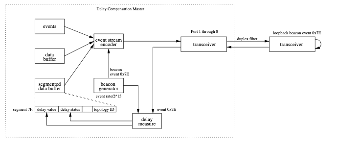

Figure 2: Timing System Master

The beacon generator sends out the beacon event (code 0x7e) at a rate of
event clock/215. When the next node receives the beacon it sends it
immediately back to the master which measures the propagation delay of
the beacon event. The delay measurement precision improves with time and
takes up to 15 minutes to stabilise. The delay value (half of the loop
delay) and delay status for each SFP port is sent out using the
segmented data buffer. In case the link returning the beacon (receiving
side of port 1 through 8) is lost the measurement value is reset and the
path delay value status is invalidated. Also if the delay value between
consecutive measurements varies significantly (by more than +/- 4 event
clock cycles) the delay measurement and delay value status is reset.

#### Timing System Fan-Out

In EVMs configured as fan-outs (DCMST = 0 and BCGEN = 0) beacons from
the Timing System Master are received by the port U transceiver. The
recovered event clock from the transceiver is filtered by a clock
cleaner external to the FPGA. A FIFO separates the cleaned event clock
domain from the recovered clock domain. The depth of the FIFO is kept
constant by adjusting the phase of the cleaned clock. Beacon events are
propagated through the fan-out and the propagation delay from port U to
the fan-out ports 1 through 8 is measured. This delay value can be read
from the IntDCValue register. Further on the beacon events get sent out
on the fan-out ports and returned by the next level of fan-outs or event
receivers. The loop delay for each port gets measured and the individual
port delay values (half of the loop delay value) can be read from the
registers Port1DCValue through Port8DCValue. Similar to the timing
system master if the link returning the beacon (receiving side of port 1
through 8) is lost the measurement value is reset and the path delay
value status is invalidated.

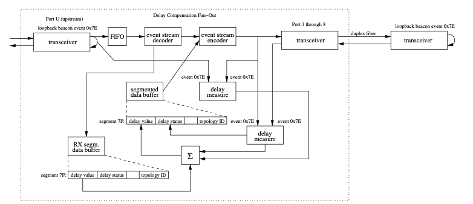

Figure 3: Timing System Fan-Out

The fan-out receives the delay compensation segment on the segmented
data buffer. This segment contains information about the delay value
from the Timing System Master up to this fan-out and the delay value
quality. The intergrated delay value from the Timing System Master up to
the fan-out can be retrieved from the UpDCValue register. The fan-out
modifies the delay value and delay status fields in the DC segment for
each port and sends out the new DC segments through ports 1 through 8.

#### Timing System Event Receiver

The Event Receiver receives the beacon event and returns it back
immediately. Based on the recovered event clock from the gigabit
transceiver the event receiver generates a local phase shifted and
cleaned event clock. The majority of the event receiver logic is running
in the cleaned event clock domain. A delay compensation FIFO separates
the transceiver receive logic from the main event receiver logic.

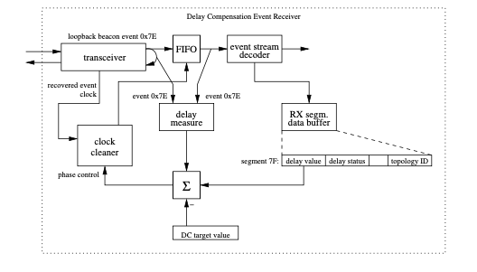

Figure 4: Timing System Event Receiver

The delay compensation segment of the segmented data buffer provides
information of the fiber path delay from the timing master up to the
event receiver. The event receiver adjusts the phase of the cleaned
event clock to control the depth of the delay compensation FIFO. When in
delay compensation mode (DCENA = 1) the event receiver controls the FIFO
depth such that the sum of the FIFO delay and the data path delay
matches the delay compensation target value set in the DCTarget
register. If the event receiver is not in delay compensation mode (DCENA
= 0) then the FIFO depth is adjusted to match the target delay value
ignoring the received data path delay value altogether.
