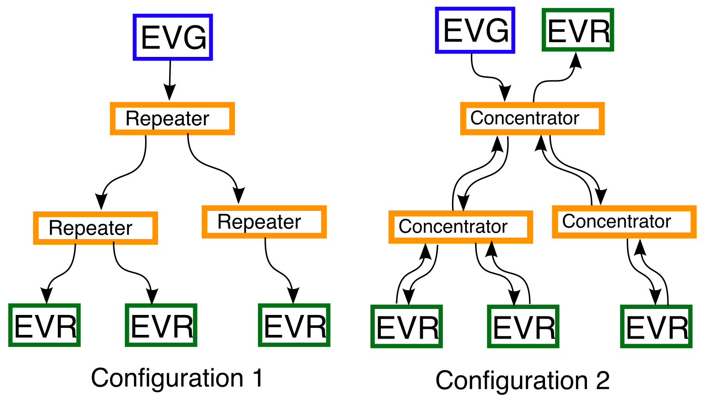
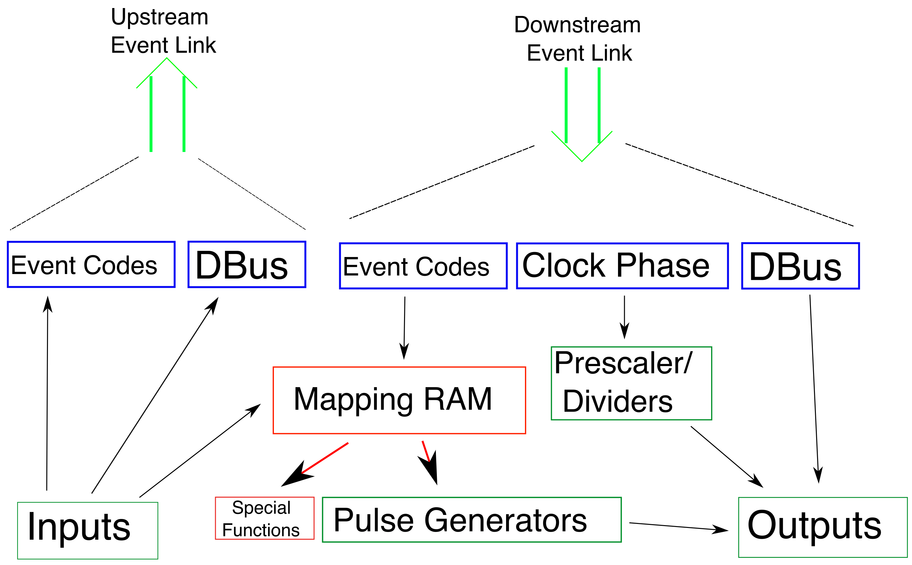

# Epics device driver for MRF Event Receiver (EVR)


## What is Available?

More infomation on the Micro Research hardware can be found on their
website <http://www.mrf.fi/>.

The software discussed below can be found on the EPICS application
project on SourceForge <http://sourceforge.net/projects/epics/>.

The latest developments can be found in the 'mrfioc2' Git VCS
repository.

<https://github.com/epics-modules/mrfioc2>

## Prerequisites

Build system required modules

EPICS Base \>= 3.14.10

:   EPICS Core\
    <http://www.aps.anl.gov/epics/base/R3-14/index.php>

MSI

:   Macro expansion tool (Base \<3.15.0 only)\
    <http://www.aps.anl.gov/epics/extensions/msi/index.php>

devLib2 \>= 2.9

:   PCI/VME64x Hardware access library\
    <https://github.com/epics-modules/devlib2/>

Build system optional modules. Not required, but highly recommended.

autosave

:   Automatic save and restore on boot\
    <http://www.aps.anl.gov/bcda/synApps/autosave/autosave.html>

iocstats

:   Runtime IOC statistics (CPU load, ...)\
    <http://www.slac.stanford.edu/comp/unix/package/epics/site/devIocStats/>\
    <http://sourceforge.net/projects/epics/files/devIocStats/>

### Target operating system requirements

RTEMS:   >= 4.9.x

vxWorks: >=6.7

Linux kernel:   >= 3.2.1 (earlier versions may work)

## Source

VCS Checkout

```
$ git clone https://github.com/epics-modules/mrfioc2.git
```

Edit 'configure/CONFIG_SITE' and 'configure/RELEASE' then run make.

The following is a brief tour of the important locations in the source
tree relating to the EVR.

## Supported Hardware

The following devices are supported.

 |       Name          | #FP[^1]  | # FP UNIV[^2] |  #FP Inputs[^3]  |  RTM[^4]   |
 | ------------------- | -------- | -------------- | ---------------- | --------- |
 |   VME-EVR-230[^5]   |    4     |        4       |          2        |     Yes  |
 |    VME-EVR-230RF    |  7[^6]   |        2       |          2        |     Yes  |
 |     PMC-EVR-230     |    3     |        0       |          1        |     No   |
 |    CPCI-EVR-230     |    0     |        4       |          2        |  Yes[^7] |
 |   cPCI-EVRTG-300    |  2[^8]   |        2       |        1[^9]      |     No   |
 |    cPCI-EVR-300     |    0     |        12      |          2        |      0   |
 |   PCIe-EVR-300DC    |    0     |        0       |          0        |     16   |
 |  mTCA-EVR-300[^10]  |    4     |       4/0      |          2        |    0/1 6 |

# System Overview

The purpose of this document is to act as a guide and reference when
using the 'mrfioc2' EPICS support module for the Micro Research Finland
(MRF) timing system[^11]. It describes software for using the Event
Generator (EVG) and Event Receiver (EVR).

The MRF Event Timing System can be deployed in two configurations (Fig.
[1](#img:sys:confs){reference-type="ref" reference="img:sys:confs"}).
The first is a unidirectional broadcast from a single source (EVG) to
multiple destinations (EVRs). The Repeater devices simply retransmit its
single input to all outputs (one to many). In the second configuration a
return path from many EVRs back up to single central (master) EVR is
added.

An EVR will act in one of two roles: either Leaf or Master. The Master
EVR is necessary because, while the generator (EVG) is capable of
receiving an event stream, it does not impliment the features of the
receiver (EVR).



Two system configurations for the MRF Timing System

What is transmitted over the event link is a combination of 8-bit event
codes and data. Data can take the form of a single 8-bit byte which is
simply copied from sender to receiver (the Distributed Bus or DBus), and
optionally a variable length byte array (Data Buffer).

These two types of data can be combined in two ways (Fig.
[2](#img:wire:frames))
depending on whether or not the Data Buffer feature is used. In
configuration A every 16-bit frame is split between an 8-bit event and
the 8-bit Distributed Bus. In configuration B every frame carries an
8-bit event with the Distributed Bus or a Data Buffer byte sent in
alternating frames.

In addition to data, the use of 8b10b encoding on the event link allows
the local oscillator of each EVR to be phase locked to a reference sent
by the EVG. The EVG itself is typically driven from an external
oscillator.


Two supported link allocation schemes.


When discussing the MRF timing system there are three clocks. The
external reference clock for the EVG, the bit clock for transceivers,
and the Event Clock. The relation between the reference and the Event
clocks is determined by a programmable divider in the EVG and is usually
a small integer number (eg. 4). The Event clock must be in the range
between 50MHz and 125MHz. The relation between the Event clock and the
bit clock is a fixed factor of 20 which is determined by the frame size
described above.

$$F_{bit}/20=F_{Event}=F_{Ext}/N_{Divide}$$

## Event Link Data

Data which is transferred over the event link is interpreted in four
ways: Event Codes, DBus bits, Data Buffers, and Clock Phase. Each
carries a different meaning, and is used in different ways.

### Event Codes

An event is momentary. Typically an event causes something to happen (a
trigger). The 255 usable event codes available in the MRF system can be
thought of as 255 seperate physical wires. On every tick of the Event
Clock a pulse is sent on one (and only one) of the "wires". Zero is the
"idle" event which is sent when no other event is queued.

Event Codes will most often be used as triggers for external delay
channels. However, there are a number of event codes which have special
meaning in the MRF system. The meaning of all other codes is left to the
system operator.


  |  Code |                                 Meaning |
  | ----- | -------------------------------------------------------------------------- |
  | 0x00  |             Idle, or null, event. Send when nothing happens.               |
  | 0x70  |                Shift 0 into EVR timestamp shift register                   |
  | 0x71  |                Shift 1 into EVR timestamp shift register                   |
  | 0x7A  |                   Reset EVR heartbeat timeout counter                      |
  | 0x7B  |             Reset all EVR dividers. Synchronize global phase               |
  | 0x7C  |           Increment EVR timestamp counter (depending on mode)              |
  | 0x7D  |                         Reset timestamp counter                            |
  | 0x7F  | End of sequence (not transmitted). Use in other contexts is discouraged.   |

Special Event codes

### Distributed Bus (DBus) bits

The Distributed Bus (DBus) consists of 8 bits of data which are stored
on every EVR. This data is initialized to zero when the EVR starts, and
overwritten whenever the EVR receives an event frame with DBus data.
Depending on configuration this is either every frame, or every second
frame (See fig. [2](#img:wire:frames){reference-type="ref"
reference="img:wire:frames"}).

The DBus can thus be used to distribute either periodic, or
non-periodic, signals with bandwidth up to $\frac{1}{2}$ (or
$\frac{1}{4}$) of the Event clock.

The bits of the DBus can be routed to physical output. A special feature
of DBus bit 4 allows its rising edge to increment the timestamp counter
(depending on mode).

### Data Buffers

When enabled, a protocol is used to broadcast arbitrary byte arrays from
the EVG to all EVRs. Bytes are sent one at a time in the data part of
every second frame. Special 8b10b codes are used to mark the beginning
and end for each transfer. A simple checksum is also sent. The 230
series hardware allows buffers up to 2047 bytes in length.

In keeping with the convention of the original MRF EPICS Support package
the first byte of a buffer is used as a header (Protocol ID) to identify
it. No restrictions are placed on the body of buffer.

### Event Clock Phase

The use of 8b10b encoding allows each EVR's local oscillator to lock to
the EVG's reference clock. This allows operation at speeds higher then
the event clock rate. This is used by the CML outputs described in
section [\[sec:evr:cml\]](#sec:evr:cml){reference-type="ref"
reference="sec:evr:cml"}.

## Global Time Distribution

The model of time implemented by the MRF hardware is two 32-bit unsigned
integers: counter, and "seconds". The counter is maintained by each EVR
and incremented quickly. The value of the "seconds" is sent periodically
from the EVG at a lower rate.

During each "second" 33 special codes (see sec.
[1](#tbl:spec:codes){reference-type="ref" reference="tbl:spec:codes"})
must be sent. The first 32 are the shift 0/1 codes which contain the
value of the next "second". The last is the timestamp reset event. When
received this code transfers the new "second" value out of the shift
register, and resets the counter to zero. These actions start the next
"second".

Note that while it is referred to as "seconds" this value is an
arbitrary integer which can have other meanings. Currently only one time
model is implemented, but implementing others is possible.

### Light Source Time Model

In this model the "seconds" value is an actual 1Hz counter. The software
default is the POSIX time of seconds since 1 Jan. 1970 UTC. Each new
second is started with a trigger from an external 1Hz oscillator,
usually a GPS receiver. Most GPS receivers have a one pulse per second
(PPS) output. Time is converted to the EPICS epoch (1 Jan. 1990) for use
in the IOC.

Several methods of sending the seconds value to the EVG are possible:

#### External hardware

has been created by Diamond light source which communicates with a GPS
receiver over a serial (RS232) link to receive the timestamp and
connects to two external inputs on the EVG. These inputs must be
programmed to send the shift 0/1 codes.

#### Time from an NTP server

can be used without special hardware. This requires only a 1Hz (PPS)
signal coming from the same source as the NTP time. Several commerial
vendors supply dedicated NTP servers with builtin GPS receivers and 1Hz
outputs. A software function is provided on the EVG which is triggered
by the 1Hz signal. At the start of each second it sends the next second
(current+1), which will be latched after the following 1Hz tick.

# Receiver Functions

Internally an EVR can be thought of as a number of logical sub-units
(Fig. [3](#img:evr:blocks){reference-type="ref"
reference="img:evr:blocks"}) connecting the upstream and downstream
event links to the local inputs and outputs. These sub-units include:
the Event Mapping Ram, Pulse Generators, Prescalers (clock dividers),
and the logical controls for the physical inputs and outputs.




Logical connections inside an EVR

## Pulse Generators

Each pulse generator has a an associated Delay, Width, Polarity (active
low/high), and (sometimes) a Prescaler (clock divider). When triggered
by the Mapping Ram it will wait for the Delay time in its inactive
state. Then it will transition to its active state, wait for the Width
time before transitioning back to its inactive state.

Resolution of the delay and width is determined by the prescaler. A
setting of 1 gives the best resolution.

In addition, the Mapping Ram can force a Pulse Generator into either
state (Active/Inactive).

## Event Mapping Ram

The Event Mapping Ram is a table used to define the actions to be taken
by an EVR when it receives a particular event code number. The mapping
it defines is a many-to-many relations. One event can cause several
actions, and one action can be caused by several events.

The actions which can be taken can be grouped into two catagories:
Special actions, and Pulse Generator actions. Special actions include
those related to timestamp distribution, and the system heartbeat tick
(see
[\[sec:spec:mappings\]](#sec:spec:mappings){reference-type="ref+page"
reference="sec:spec:mappings"} for a complete list). Each Pulse
Generater has three mapable actions: Set (force active), Reset (force
inactive), and Trigger (start delay program). Most applications will use
Trigger mappings.

## Prescalers (Clock Divider)

Prescaler sub-units take the EVR's local oscillator and output a lower
frequency clock which is phased locked to the local clock, which is in
sync with the global master clock. The lower frequency must be an
integer divisor of the Event clock.

To provide known phase relationships, all dividers can be synchronously
reset when a mapped event code is received. This is the Reset PS action.
See
[\[sec:spec:mappings\]](#sec:spec:mappings){reference-type="ref+page"
reference="sec:spec:mappings"}.

## Outputs (TTL)

This sub-unit represents a local physical output on the EVR. Each output
may be connected to one source: a Distributed Bus bit, a Prescaler, or a
Pulse Generator (see
[\[sec:out:mappings\]](#sec:out:mappings){reference-type="ref+page"
reference="sec:out:mappings"} for a complete list).

## Outputs (CML and GTX)

Current Mode Logic outputs can send a bit pattern at the bit rate of the
event link bit clock (20x the Event Clock). This pattern may be
specified in one of three possible ways.

As four 20 bit sub-patterns (rising, high, falling, and low). As two
periods (high and low). These specify a square wave with variable
frequency and duty factor. As an arbitrary bit pattern (\<= 40940 bits)
which begins when the output goes \[TODO: high or low?\].

In the sub-pattern mode. The rising and falling patterns are transmitted
when the output level changes, while the high and low patterns are
repeated in between level changes.

The GTX outputs found only on the EVRTG ($e^{-}$gun) receiver function
similarly to the CML outputs at twice the frequency. Thus for this
device patterns are 40 bits.

## Inputs

An EVR's local TTL input can cause several actions when triggered. It
may be directly connected to one of the upstream Distributed Bus bits,
it may cause an event to be sent on the upstream links, or applied to
the local Mapping Ram.

The rising edge of a local input can be timestamped.

## Global Timestamp Reception

Each EVR receives synchronous time broadcasts from an EVG. Software may
query the current time at any point. The arrival time of certain event
codes can be saved as well. This can be accomplished with the 'event'
record device support.

Each EVR may be configured with a different method of incrementing the
timestamp counter. See section
[\[sec:evr:ts:src\]](#sec:evr:ts:src){reference-type="ref"
reference="sec:evr:ts:src"}.

In addition to being slaved to an EVG, those EVR models/firmware which
provide a Software Event transmission function can send timestamps as
well. This can be used to simulate timestamps in a standalone
environment such as a test lab. see the TimeSrc property in
[\[sec:evg:dc:func\]](#sec:evg:dc:func){reference-type="ref+page"
reference="sec:evg:dc:func"}.

TimeSrc=0

:   The default, which disables EVR timestamp generation.

TimeSrc=1

:   In External mode the EVR will send a timestamp when event 125 is
    received. Reception of 125 can be either from an input, or for DC
    EVRs the sequencer.

TimeSrc=2

:   In Sys Clock mode, the EVR will generate a software 125 event based
    on the system clock. This is the simplest standalone mode.

## Data Buffer Tx/Rx

A recipient can register callback functions for each Protocol ID. It
will then be shown the body of every buffer arriving with this ID.

A default recipient is provided which stores data in a waveform record.

# IOC Deployment

This section outlines a general strategy for adding an EVR to an IOC.
First general information is presented, followed by a section describing
the extra steps needed to use mrfioc2 under Linux.

An example IOC shell script is included as "iocBoot/iocevrmrm/st.cmd".

## Device names

All EVGs and EVRs in an IOC are identified by an unique name. This is
first given in the IOC shell functions described below, and repeated in
the INP or OUT field of all database records which reference it. Both
EVGs, and EVRs share the same namespace. This restriction is needed
since some code is shared between these two devices.

## VME64x Device Configuration

The VME bus based EVRs and EVGs are configured using one of the
following IOC shell functions.

```
# Receiver
mrmEvrSetupVME("anEVR", 3, 0x30000000, 4, 0x28)
```

In this example EVR "anEVR" is defined to be the VME card in slot 3. It
is given the A32 base address of 0x30000000 and configured to interrupt
on level 4 with vector 0x28.

## PCI Device Configuration

PCI bus cards are identified with the mrmEvrSetupPCI() IOC shell
function.

Since PCI devices are automatically configured only the geographic
address (bus:device.function) needs to be provided. This information can
usually be found at boot time (RTEMS) or in /proc/bus/pci/devices
(Linux).

The IOC shell function devPCIShow() is also provided to list PCI devices
in the system.

```
# Receiver
mrmEvrSetupPCI("PMC", "1:2.0")
```

This example defines EVR "PMC" to be bus 1 device 2 function 0.

Support for using mTCA slot number is available on some targets (Linux
only as of devlib2 2.9). This does any automatic lookup of PCI address
from slot number. Be aware that PCIe "slot" numbers, while stable across
reboots, may change with hardware configuration, firmware, or OS
upgrades.

    mrmEvrSetupPCI("PMC", "slot=5")

## PCI Setup in Linux

In order to use PCI EVRs in the Linux operating system a small kernel
driver must be built and loaded. The source for this driver is found in
'mrmShared/linux/'. This directory contains a Makefile for use by the
Linux kernel build system (not EPICS).

To build the driver you must have access to a configured copy of the
kernel source used to build the target system's kernel. If the build and
target systems use the same kernel, then the location will likely be
'/lib/modules/'uname -r'/build'. In case of a cross-built kernel the
location will be elsewhere.

To build the module for use on the host system:

```
$ make -C /location/of/mrmShared/linux \
KERNELDIR=/lib/modules/`uname -r`/build modules_install
$ sudo depmod -a
$ sudo modprobe mrf
```

Building for a cross-target might look like:

```
$ make -C /location/of/mrmShared/linux \
KERNELDIR=/location/of/kernel/src \
ARCH=arm CROSS_COMPILE=/usr/local/bin/arm- \
INSTALL_MOD_PATH=/location/of/target/root \
modules_install
```

Once the module is installed on the running target the special device
file associated with each EVR must be created. If your target system is
running UDEV this will happen automatically. See mrmShared/linux/README
for example UDEV config. If UDEV is not present, then you must do the
following.

```
# grep mrf /proc/devices
254 mrf
# mknod -m 666 /dev/uio0 c 254 0
```

If may be necessary to change the file permission to allow the IOC
process to open it. UDEV users may find one of the following commands
useful for constructing a rules file.

    # udevinfo -a -p $(udevinfo -q path -n /dev/uio0 )

    # udevadm info -a -p $(udevadm info -q path -n /dev/uio0 )

Each additional device adds one to the number (uio1, uio2, \...).

Once the device file exists with the correct permissions the IOC will be
able to location it based on the bus:device.function given an to
mrmEvrSetupPCI().

## Example Databases

The MRFIOC2 module includes example database templates for all supported
devices (see [\[sec:supported\]](#sec:supported){reference-type="ref"
reference="sec:supported"}). While each is fully functional, it is
expected that most sites will make modifications. It is suggested that
the original be left unchanged and a copy be made with the institute
name and other information as a suffix. (evr-pmc-230.substitutions
becomes evr-pmc-230-nsls2.substitutions).

The authors would like to encourage users to send their customized
databases back so that they may be included as examples in future
releases of MRFIOC2.

The templates consist of a substitutions file for each model (PMC, cPCI,
VME-RF). This template instanciates the correct number of records for
the inputs/outputs found on each device. It also includes entries for
event mappings and database events which will be frequent targets for
customization.

Each substitutions file will be expanded during the build process with
the MSI utility to create a database file with two undefined macros (P
and C). 'SYS' and 'D' define a common prefix shared by all PVs and must
be unique in the system. 'EVR' is a card name also given as the first
argument of one of the mrmEvrSetup\*() IOC shell functions (unique in
each IOC).

Thus an IOC with two identical VME cards could use a configuration like:

```
mrmEvrSetupVME("evr1",5,0x20000000,3,0x26)
mrmEvrSetupVME("evr2",6,0x21000000,3,0x28)
dbLoadRecords("evr-vmerf-230.db", "SYS=test, D=evr:a, EVR=evr1")
dbLoadRecords("evr-vmerf-230.db", "SYS=test, D=evr:b, EVR=evr2")
```

### autosave

All example database files include "info()" entries to generate autosave
request files. The example IOC shell script "iocBoot/iocevrmrm/st.cmd"
includes the following to configure autosave.

    save_restoreDebug(2)
    dbLoadRecords("db/save_restoreStatus.db", "P=mrftest:") 
    save_restoreSet_status_prefix("mrftest:")

    set_savefile_path("${mnt}/as","/save")
    set_requestfile_path("${mnt}/as","/req")

This enables some extra debug information which is useful for testing,
and loads the autosave on-line status database. It also sets the
locations where .sav and .req files will be searched for.

    set_pass0_restoreFile("mrf_settings.sav")
    set_pass0_restoreFile("mrf_values.sav")
    set_pass1_restoreFile("mrf_values.sav")
    set_pass1_restoreFile("mrf_waveforms.sav")

Sets three files which will be loaded. The "values" are loaded twices as
is the autosave convention.

    iocInit()

    makeAutosaveFileFromDbInfo("as/req/mrf_settings.req", "autosaveFields_pass0") 
    makeAutosaveFileFromDbInfo("as/req/mrf_values.req", "autosaveFields") 
    makeAutosaveFileFromDbInfo("as/req/mrf_waveforms.req", "autosaveFields_pass1")

After the IOC has started the request files are generated. This is where
the "info()" entries in the database files are used.

    create_monitor_set("mrf_settings.req", 5 , "")
    create_monitor_set("mrf_values.req", 5 , "")
    create_monitor_set("mrf_waveforms.req", 30 , "") 

Finally the request files are re-read and monitor sets are created.

# Testing Procedures

This section presents several step by step procedures which may be
useful when testing the function of hardware and software.

In the "documentation/demo/" directory several IOC shell script files
with the commands given in this section as well as other examples.

## EVG and EVR Checkout

This procedure requires both a generator, receiver, and a fiber jumper
cable to connect them.

It is assumed that no cables are connected to the front panel of either
EVG or EVR. The example "iocBoot/iocevrmrm/st.cmd" script is used with
`SYS=TST` and `D=evr` for the receiver and `D=evg` for the generator.
Verify this with the following commands at the IOC shell.

    >dbgrep("*Link:Clk-SP")
    TST{evr}Link:Clk-SP
    >dbgrep("*FracSynFreq-SP")
    TST{evg-EvtClk}FracSynFreq-SP

The following examples use the IOC shell commands `dbpr()` and `dbpf()`.
Remote use of `caput` and `caget` is also possible.

    >dbpf("TST{evg-EvtClk}Source-Sel","FracSyn")
    >dbpf("TST{evg-EvtClk}FracSynFreq-SP","125.0")
    >dbpf("TST{evr}Link:Clk-SP","125.0")
    >dbpf("TST{evr}Ena-Sel","Enabled")
    >dbpr("TST{evr}Link-Sts")
    ...
    ... VAL: 0

This sets the event link speed on both the EVR and EVG. The EVG is
commanded to use its internal synthesizer instead of an external clock.

Now use the fiber jumper cable to connect the TX port of the generator
to the RX port of the receiver. (The Tx port will have a faint red light
coming from it).

Once connected the red link fail LED should go off and the link status
PV should read OK (1).

    >dbpr("TST{evr}Link-Sts")
    ...
    ... VAL: 1

At this point the receivier has locked to the generator signal, but no
data is being sent. This includes the heartbeat event. Thus the
heartbeat timeout counter should be increasing.

    >dbpr("TST{evr}Cnt:LinkTimo-I")
    ...
    ... VAL: 45
    >dbpr("TST{evr}Cnt:LinkTimo-I")
    ...
    ... VAL: 47

Now we will set up the generator to send a periodic event code.

    >dbpf("TST{evg-Mxc:0}Prescaler-SP", "125000000")
    >dbpr("TST{evg-Mxc:0}Frequency-RB",1)
    ...
    EGU: Hz ...
    ... VAL: 1
    >dbpf("TST{evg-TrigEvt:0}EvtCode-SP", "122")
    >dbpf("TST{evg-TrigEvt:0}TrigSrc-Sel", "Mxc0")
    >dbpf("TST{evg-TrigEvt:1}EvtCode-SP", "125")
    >dbpf("TST{evg-TrigEvt:1}TrigSrc-Sel", "Mxc0")
    >dbpf("TST{evr}Evt:Blink0-SP", "125")

This configures multiplexed counter 0 (Mxc #0) to trigger on the event
clock frequency divided by 125000000. In this case this gives 1Hz.
Trigger event #0 is then configured to send event code 122, and trigger
event #1 to send code 125, when Mxc #0 triggers.

At this point both the EVG's amber EVENT OUT led and the EVR's EVENT IN
led should flash at 1Hz.

For diagnostics the EVR's Blink0 mapping is configured to blink the
EVR's EVENT OUT led when event code 125 is received. Setting to 0 will
cause it to stop blinking.

Event code 122 is the heartbeat reset event. Since it is being sent the
link timeout counter should no longer be increasing.

    >dbpr("TST{evr}Cnt:LinkTimo-I")
    ...
    ... VAL: 120
    >dbpr("TST{evr}Cnt:LinkTimo-I")
    ...
    ... VAL: 120

At this point, if the system is given an NTP server the EVG will get a
correct (but unsynchronized) time and messages similar to the following
will be printed.

    Starting timestamping
    epicsTime: Wed Jun 01 2011 17:54:53.000000000
    TS becomes valid after fault 4de6b533

The first two lines come from the EVG and indicate that it is sending a
timestamp. The third line comes from the EVR and indicates that it is
receiving a correct timestamp.

The counter for the 1Hz event should now be increasing.

    >dbpr("TST{evr}1hzCnt-I")
    ... VAL: 5
    >dbpr("TST{evr}1hzCnt-I")
    ... VAL: 6

## Timestamp Test

An external 1Hz pulse generator is required for this test. It should be
connected to front panel input 0 on the EVG. This is LEMO connector
expecting a TTL signal.

    >dbpr("TST{evr}Link-Sts")
    ...
    ... VAL: 1

If the event link status is not OK then perform setup as described in
the previous test.

Check the current time source status

    >generalTimeReport(2)
    Backwards time errors prevented 0 times.

    Current Time Providers:     "EVR", priority = 50
            Current Time not available
        "NTP", priority = 100
            Current Time is 2011-06-02 10:23:26.058125.
        "OS Clock", priority = 999
            Current Time is 2011-06-02 10:23:26.057101.

    Event Time Providers:
        "EVR", priority = 50

This shows that the NTP time source is functioning. This is required for
this test.

    >dbpf("TST{evg-TrigEvt:1}EvtCode-SP", "125")
    >dbpf("TST{evg-TrigEvt:1}TrigSrc-Sel", "Front0")
    >dbpf("TST{evr}Evt:Blink0-SP", "125")

Sends event code 125 on the rising edge for front panel input 0. For
diagnostics sets the blink mapping. If the led is not blinking then
check the 1Hz pulse generator.

    dbpr("TST{evr}Time:Valid-Sts")
    ...
    ... VAL: 1

Indicates that the EVR has received a valid time

    >generalTimeReport(2)
    Backwards time errors prevented 0 times.

    Current Time Providers:     "EVR", priority = 50
            Current Time is 2011-06-02 10:26:50.683808.
        "NTP", priority = 100
            Current Time is 2011-06-02 10:26:50.681220.
        "OS Clock", priority = 999
            Current Time is 2011-06-02 10:26:50.683854.

    Event Time Providers:
        "EVR", priority = 50

Shows that a valid time is now being reported.

    $ camonitor TST{evr:3}Time-I 
    TST{evr:3}Time-I               2011-06-02 10:32:11.999993 Thu, 02 Jun 2011 10:32:12 -0400   
    TST{evr:3}Time-I               2011-06-02 10:32:12.999993 Thu, 02 Jun 2011 10:32:13 -0400   
    TST{evr:3}Time-I               2011-06-02 10:32:13.999993 Thu, 02 Jun 2011 10:32:14 -0400   
    TST{evr:3}Time-I               2011-06-02 10:32:14.999993 Thu, 02 Jun 2011 10:32:15 -0400

The timestamp indicator record takes its record timestamp from the
arrival of the 125 event code. As can be seen, this time is stored
immediately before the sub-seconds is zeroed. This can be verified by
switching this.

    $ caget TST{evr:3}Time-I.TSE
    TST{evr:3}Time-I.TSE           125
    $ caput TST{evr:3}Time-I.TSE 0
    Old : TST{evr:3}Time-I.TSE           125 
    New : TST{evr:3}Time-I.TSE           0 
    $ camonitor TST{evr:3}Time-I 
    TST{evr:3}Time-I               2011-06-02 10:35:31.005655 Thu, 02 Jun 2011 10:35:31 -0400   
    TST{evr:3}Time-I               2011-06-02 10:35:32.005655 Thu, 02 Jun 2011 10:35:32 -0400   
    TST{evr:3}Time-I               2011-06-02 10:35:33.005655 Thu, 02 Jun 2011 10:35:33 -0400   
    TST{evr:3}Time-I               2011-06-02 10:35:34.005655 Thu, 02 Jun 2011 10:35:34 -0400

Now a time latched by software when this record is processed. For
real-time system this time should be stable.

# Firmware Update

## 300-series Devices

-   PCIe-EVR-300DC

-   mTCA-EVR-300

-   mTCA-EVM-300

These devices support upgrade of firmware through PCIe register access.
As such, a failed upgrade will result in an unusable device.

To test if a card may be upgrade with this mechanism, run *flashinfo*
and *flashread* command. The following shows a device which can be
upgraded.

    epics> mrmEvrSetupPCI("EVR1", "03:00.0")
      ...
    epics> flashinfo("EVR1:FLASH")
    Vendor: 20 (Micron)
    Device: ba
    ID: 18
    Capacity: 0x1000000
    Sector: 0x10000
    Page: 0x100
    S/N:  23 51 61 31 16 00 14 00 31 26 05 15 ee 45
    epics> flashread("EVR1:FLASH", 0, 64)
    00090ff0 0ff00ff0 0ff00000 0161001f
    70636965 65767233 30306463 3b557365
    7249443d 30584646 46464646 46460062
    000c376b 37307466 62673637 36006300
    epics>

Before upgrading, it is suggested to backup the existing firmware. If
the size of the existing firmware is known, then this size can be used.
Otherwise, use the capacity reported by *flashinfo*. All Xilinx bit
files for a particular device typically have the same size.

In this example of a PCIe-EVR-300DC with the 207.0 firmware, the exact
size is 3011417 bytes, which we arbitrarily round up to 3MB.

    epics> flashread("EVR1:FLASH", 0, 0x300000, "PCIe-EVR-300DC.207.0.backup.bit")
    | 3080192
      ...

Now write the new firmware file.

    epics> flashwrite("EVR1:FLASH", 0, "PCIe-EVR-300DC.207.6.bit")

If the update process is interrupted, **do not power cycle**! Re-run the
update process to completion.

After the write completes successfully, power cycle the card to load the
new bit file.

## VME EVRs and EVGs

Update for VME cards is accomplished through the ethernet jack label "10
BaseT". The procedure covered in the MRF manual.

## cPCI-EVRTG-300

Undocumented.

## PMC-EVR-230

Firmware update for the PMC module EVR is accomplished through a JTAG
interface as with the cPCI-EVRTG-300. For reasons of physical space the
JTAG wires are not brought to a connector, but connected to 4 I/O pins
of the PLX 9030 PCI bridge chip. In order to control these pins and
update the firmware some additional software is needed. Software update
may be performed by using either the parallel port support or through
JTAG pins. The running Kernel must be built with the CONFIG_GENERIC_GPIO
and CONFIG_GPIO_SYSFS options if the latter approach is to be used.

If the parallel port support is available, a message is printed to the
kernel log when the Linux kernel module provided with mrfioc2
(mrmShared/linux) is loaded.

    Emulating cable: Minimal

The kernel module also exposes the 4 I/O pins via the Linux GPIO API.
The 4 pins are numbered in the order: TCK, TMS, TDO, and TDI. The number
of the first pin is printed to the kernel log when the MRF kernel module
is loaded.

    GPIO setup ok, JTAG available at bit 252

In this example the 4 pins would be TCK=252, TMS=253, TDO=254, and
TDI=255.

### Creating an SVF file from a BIT file

The firmware file will likely be supplied in one of two formats having
the extensions .bit or .svf. If the provided file has the extension .svf
then proceed to section
[\[sec:pmc:prog\]](#sec:pmc:prog){reference-type="ref"
reference="sec:pmc:prog"}.

To convert a .bit file to a .svf file it is necessary to get the iMPACT
programming tool from Xilinx. The easiest way to do this is with the
"Lab Tools" bundle.

<http://www.xilinx.com/support/download/index.htm>

The following instructions are for iMPACT version 14.2.

1.  Install and run the iMPACT program.

2.  When prompted to create a project click cancel

3.  On the left side of the main window is a pane titled "iMPACT FLows".
    Double click on "Create PROM File"

4.  Select "Xilinx Flash/PROM" and click the first green arrow.

5.  Select "Platform Flash" and "xcf08p" and click "Add Storage Device"
    then the second green arrow.

6.  Select an output file name and path. Ensure that the file format is
    MCS. Click OK

7.  Several small dialogs will appear. When prompted to "Add device"
    select the .bit file provided by MRF.

8.  When prompted to add another device click No.

9.  On the left side of the main window is a pane titled "iMPACT
    Processes". Double click on "Generate File".

10. The .mcs file should now be written.

11. Exit and restart iMPACT.

See <http://www.xilinx.com/support/documentation/user_guides/ug161.pdf>
starting on page 67 for more detailed instructions.

1.  Create a new iMPACT project. Select "Prepare a Boundary-Scan File"
    and the SVF format.

2.  When prompted, select a name for the resulting .svf file

3.  When prompted to "Assign New Configuration File" select the .mcs
    file just created.

4.  When prompted to select a PROM type choose "xcf08p"

5.  An icon representing the PROM should now appear as the only entry in
    the JTAG chain.

6.  Right click on this icon and select Program.

7.  In the dialog which appears check Verify and click OK.

8.  The .svf file should now be written.

9.  Exit iMPACT

### Programming with UrJTAG

<http://urjtag.org/>

As of August 2012 support to the Linux GPIO "cable" was not included in
any UrJTAG release. It is necessary to checkout and build the
development version (commit id b6945fc65 from 9 Aug. 2012 works). This
requires the Git version control tool. To build and use UrJTAG on target
system, there may be a need to install certain packages in the system.

    $ sudo apt-get install pciutils make autoconf autopoint libtool
    pkg-config bison libusb-1.0-0-dev libusb-dev flex python-dev

With all necessary tools available, configure and build UrJTAG.

    $ git clone git://urjtag.git.sourceforge.net/gitroot/urjtag/urjtag
    $ cd urjtag/urjtags
    $ ./autogen.sh --disable-nls --disable-python --prefix=$PWD/usr
    $ make && make install

Firmware update may be performed using the parallel port support if
available, e.g. when loading the kernel driver:

    $ sudo modprobe uio
    $ sudo modprobe parport
    $ sudo insmod mrf.ko
    $ dmesg
    ...
    [   69.046938] mrf-pci 0000:08:0d.0: MRF Setup complete
    [   69.047007] mrf-pci 0000:09:0e.0: PCI IRQ 72 -> rerouted to legacy IRQ 16
    [   69.047589] mrf-pci 0000:09:0e.0: GPIOC 00249412
    [   69.047626] mrf-pci 0000:09:0e.0: GPIO setup ok, JTAG available at bit 252
    [   69.144196] mrf-pci 0000:09:0e.0: Emulating cable: Minimal
    [   69.144239] mrf-pci 0000:09:0e.0: MRF Setup complete
    ...

The "Emulating cable: Minimal" message indicates that Minimal JTAG cable
type can be used to communicate with a device. A ppdev device should be
available for usage with UrJTAG:

    $ sudo modprobe ppdev
    $ dmesg
    ...
    [   69.028268] ppdev: user-space parallel port driver
    ...
    $ ls /dev | grep parport
    parport0

On the target system run UrJTAG as root:

    # ./usr/bin/jtag
    jtag> cable Minimal ppdev /dev/parport0
    Initializing ppdev port /dev/parport0
    jtag> detect
    IR length: 26
    Chain length: 2
    Device Id: 00100001001000111110000010010011 (0x2123E093)
      Manufacturer: Xilinx (0x093)
      Part(0):      xc2vp4 (0x123E)
      Stepping:     2
      Filename:     /epics/urjtag/share/urjtag/xilinx/xc2vp4/xc2vp4
    Device Id: 11100101000001010111000010010011 (0xE5057093)
      Manufacturer: Xilinx (0x093)
      Part(1):      xcf08p (0x5057)
      Stepping:     14
      Filename:     /epics/urjtag/share/urjtag/xilinx/xcf08p/xcf08p
    jtag> part 1
    jtag> svf /location/of/pmc-prom.svf stop progress

Alternatively, a GPIO cable may be utilized if the kernel was built with
options required (CONFIG_GENERIC_GPIO and CONFIG_GPIO_SYSFS), on the
target system run UrJTAG as root (or a user which can export and use
GPIO pins).

    # ./usr/bin/jtag
    jtag> cable gpio tck=252 tms=253 tdo=254 tdi=255
    jtag> detect
    IR length: 26
    Chain length: 2
    Device Id: 00100001001000111110000010010011 (0x2123E093)
      Manufacturer: Xilinx (0x093)
      Part(0):      xc2vp4 (0x123E)
      Stepping:     2
      Filename:     /epics/urjtag/share/urjtag/xilinx/xc2vp4/xc2vp4
    Device Id: 11100101000001010111000010010011 (0xE5057093)
      Manufacturer: Xilinx (0x093)
      Part(1):      xcf08p (0x5057)
      Stepping:     14
      Filename:     /epics/urjtag/share/urjtag/xilinx/xcf08p/xcf08p
    jtag> part 1
    jtag> svf /location/of/pmc-prom.svf stop progress

Note that the device IDs may not be correctly recognized. This will not
effect the programming process.

If no errors are printed then the update process was successful. The new
firmware will not be loaded until the PMC module is reset (power cycle
system).

# NTPD Time Source

It is possible to use an EVR as a time source for the system NTP daemon
on Linux. This is implemented using the shared memory clock driver
(#28).

<http://www.eecis.udel.edu/~mills/ntp/html/drivers/driver28.html>

An IOC is configured to write data to a shared memory segment by adding
a line to its start script.

    time2ntp("evrname", N)

Here "evrname" is the same name given when configuring the EVR (see
[\[sec:devnames\]](#sec:devnames){reference-type="ref"
reference="sec:devnames"}). The memory segment ID number N must be
between 0 and 4 inclusive. The NTP daemon enforces that segments 0 and 1
require root permissions to use. Segments 2, 3, and 4 can be accessed by
an unprivileged user.

It is suggested to use an unprivileged segment to avoid running the IOC
as root. However, this would allow any user on the system to effectively
control NTPD. So it is not recommended for systems with untrusted users.

The NTP daemon is configured from the file */etc/ntp.conf*. On Debian
Linux systems using DHCP it will be necessary to modify
*/etc/dhcp/dhclient-exit-hooks.d/ntp* instead.

    server 127.127.28.N minpoll 1 maxpoll 2 prefer
    fudge 127.127.28.N refid EVR

This will configure NTPD to read time from segment N. Here N must match
what was specified for *time2ntp()*.

When functioning correctly NTPD status should look like:

    $ ntpq -p
    remote           refid      st t when poll reach   delay   offset  jitter
    =========================================================================
    +time.cs.nsls2.l .GPS.      1 u   29   64  377    2.684   -0.001   0.089
    *SHM(3)          .EVR.      0 l    7    8  377    0.000    0.000   0.001

The shared memory interface can only be used to provide time with
microsecond precision. So this measurement, taken from a production
NSLS2 server, showing a jitter of $\pm1$ microsecond is the best which
can be obtained.

If the propagation time from the time source to the EVR is known, then
the offset can be given by adding "time1 0.XXX" to the 'fudge' line in
*ntp.conf*.

# Buffered Timestamp Capture

Some applications are interested in the precise reception timestamp of
an asynchronous event code. For example, an External event code from an
EVR Input. Further, if this Input/event code occurs at a high rate, it
is preferable for software to process reception times in batches.

The motivating use case for this feature was monitoring of a rotational
encoder which produces a pulse on crossing a particular angle. The times
of this crossing are needed to calculate frequency and phase. Further,
crossing occur at \~1KHz.

Buffers are setup by loading instances of the `db/mrmevrtsbuf.db`
database. Many buffers may be loaded. While un-useful it is possible to
associate multiple buffers with the same event code.

    dbLoadRecords("db/evr-pcie-300dc.db","SYS=TST, D=evr:1, EVR=EVR,\
                   FEVT=125")
    dbLoadRecords("db/mrmevrtsbuf.db", "SYS=TST, D=evr:1-ts:1, EVR=EVR,\
                   CODE=20, TRIG=10, FLUSH=TimesRelFlush")

In this example, the (optional) CODE and TRIG macros name two event
codes. CODE=20 is the event for which the reception time will be
captured. The (also optional) TRIG=10 is an event for which reception
will cause the internal buffer of timestamps to be flushed to a waveform
record. Alternately, flushing can be triggered by another record.

The CODE and TRIG macros are setting the default values of fields which
may be changed at runtime.

Each waveform record which present timestamps does so in a format
determined by the FLUSH macro.

TimesRelFlush

:   Elements are times in nanoseconds relative to the flushing action
    (either flush event code, or manual flush). The time of the flushing
    action is stored as the record timestamp. Element values are always
    negative. This is the default if FLUSH is not set.

TimesRelFirst

:   Elements are times in nanoseconds relative to the time of the first
    event received after a previous flush. The time of the first event
    is stored in the record timestamp. Element values are always
    positive, and the first element value is always zero.

# Implementation Details

Details of some parts of the driver which may be useful in understanding
(and trouble shooting) the behavior of the driver.

## Event code FIFO Buffer

Each EVR implements a hardware First In First Out buffer for event
codes. When certain "interesting" event code numbers are received the
code and arrival time are placed in this buffer. Two interrupt condition
are generated by the FIFO: not empty, and full. The first is asserted
when the first event added, and cleared when the last event is removed.
The second occurs when last free entry in the buffer is consumed.
Further event occurrences are lost.

When the not empty interrupt occurs the fifo drain task (named EVRFIFO
in epicsThreadShowAll()) is woken up by a message queue. This task runs
at scan high priority (90). Once awakened it will remove at most 512
event codes from the buffer before sleeping again. The number 512 is an
arbitrary number chosen to prevent the starvation of lower priority
tasks if a high frequency event code is accidentally mapped into the
FIFO. A minimum sleep time is enforced by the **mrmEvrFIFOPeriod**
variable. This governs the maximum rate that events can be reported
through the FIFO. Setting to 0 will disable it.

Each of the event codes 1-255 has an IOSCANPVT and a list of callback
functions (type EVR::eventCallback) which will be invoked when the event
occurs.

An invocation of an IOSCANPVT list may place an arbitrary number of
CALLBACKs into the message queue of the three EPICS callback scan tasks
(High, Medium, and Low). If these message queues are overflowed then
CALLBACK in other drivers my be lost. The scanIoRequest() function does
not report this error prior to Base 3.15.0.2.

To avoid this disastrous occurrence the EVR driver will not re-run the
scan list for an event, until all actions **at all priorities** from the
previous run have finished. This is implemented by placing a special
sentinel CALLBACK in all three queues. An event will not be re-run until
all three of the CALLBACK have run.

The FIFO servicing code can indicate two error conditions. Occurrences
of these errors are recorded in the `FIFO Overflow Count` and
`FIFO Over rate` counters.

The `FIFO Overflow Count` gives the number of times the hardware FIFO
buffer has overflowed. This is a serious error since arbitrary event
code (including the timestamping codes) will be lost.

The `FIFO Over rate` counter counts the number of times any event
reoccurred before the actions of the last occurrence were finished
processing. This is less serious since other event codes are not
effected.

## Data Buffer reception

Each EVR can receive a single data buffer. Once a data message has been
received, the reception engine is disabled to allow time to download the
buffer. Then the engine can be re-enabled in preparation for the next
message. An interrupt is generated when the message has been fully
received, and the engine disabled.

Instead of a separate thread, buffer reception is implemented as a two
stage callback run by the High (first) and Medium (second) priority scan
tasks. The first callback copies the buffer into memory and immediately
re-enables buffer reception, it then passes the data to the second
callback. This callback passes the buffer to a list of user callback
functions which have registered interest in the Protocol ID found in the
message header.

## Timestamp validation

It is impossible to verify a time without a second trusted reference.
Since such a reference is not generally available, the driver can only
make some checks against corruption.

The seconds part of the timestamp should only change when the 1Hz reset
event (125) is received from the EVG. Therefore a callback is attached
to that event code. When a new seconds value arrives it is compared to
the previous stored value. If it is exactly 1 greater then it is taken
to be the new seconds value. If it is not then the EVR time is declared
invalid.

When the time is invalid, it can only become valid after five sequential
seconds values are received. Any out of sequence value resets the count.

# EVR Device Support Reference

The EPICS support module for MRF devices consists of a number of
supports which are generally tied to a specific logical sub-unit. Each
sub-unit may be thought of as an object having a number of properties.
For example, each Delay Generator has properties 'Delay' and 'Width'.
These properties can be read or modified in several ways. A delay can
specified as an integer number of ticks of its reference clock (hardware
view), or in seconds as a floating point number (user view).

In this example the properties 'Delay' and 'Width' should be settable in
exact integer as well as the more useful, but imprecise, floating point
units (eg. seconds). This needs to be accomplished by two different
device supports (longout, and ao). Of course it is also useful to have
some confirmation that settings have been applied so read-backs are
desireable (longin, ai).

Some of the device supports defined are as follows. The full list is
given in **`mrfCommon/src/mrfCommon.dbd`**`. `

``` {.dbd language="dbd"}
device(longin , INST_IO, devLIFromUINT32, "Obj Prop uint32")
device(longin , INST_IO, devLIFromUINT16, "Obj Prop uint16")
device(longin , INST_IO, devLIFromBool,   "Obj Prop bool")

device(ai , INST_IO, devAOFromDouble, "Obj Prop double")
device(ai , INST_IO, devAOFromUINT32, "Obj Prop uint32")
device(ai , INST_IO, devAOFromUINT16, "Obj Prop uint16")
```

Unless otherwise noted, all device support use **INST_IO** input/output
links with the format:

    @OBJ=$(OBJECTNAME), PROP=Property Name

Since the Pulser sub-unit has the property 'Delay' which supports both
integer and float settings, the following database can be constructed.

``` {.dbd language="dbd"}
record(ao, "$(PN)Delay-SP")
{
  field(DTYP, "Obj Prop double")
  field(OUT , "@OBJ=$(OBJ), PROP=Delay")
  field(PINI, "YES")
  field(DESC, "Pulse Generator $(PID)")
  field(FLNK, "$(PN)Delay-RB")
}
record(ai, "$(PN)Delay-RB")
{
  field(DTYP, "Obj Prop double")
  field(INP , "@OBJ=$(OBJ), PROP=Delay")
  field(FLNK, "$(PN)Delay:Raw-RB")
}
record(longin, "$(PN)Delay:Raw-RB")
{
  field(DTYP, "Obj Prop uint32")
  field(INP , "@OBJ=$(OBJ), PROP=Delay")
}
```

This provides setting in engineering units and readbacks in both EGU and
raw for the delay property.

**Note:** In is inadvisible to have to more then one output record
pointing to the same property of the same device. However, it is allowed
since there are cases where this is desireable.

**Note:** Documentation of individual device support may be found in the
example database files.

## Per-device Database Files

Several database are installed by default for use with certain devices.
Use with different devices is not an error, but will result in warnings
being printed for sub-units included in the database file, but not
physically present.

-   db/evr-cpci-230.db

-   db/evr-cpci-300.db

-   db/evr-mtca-300.db

-   db/evr-pcie-300dc.db

-   db/evr-pmc-230.db

-   db/evr-tg-300.db

-   db/evr-vmerf-230.db

## Special Database Files

Several database files are provided to augment the per-device files.
These optional files are not tied to a specific hardware sub-unit.

-   db/evrevent.db

Adds a reception counter for a specific event code.

-   db/mrmevrtsbuf.db

Adds a capture buffer for reception times of a certain, fast, event
code.

-   db/evralias.db

A set of alias() entries to give an alternative (application specific)
name prefix(s) for anEVR pulser.

-   db/databuftx.db

-   db/mrmevrbufrx.db

Examples of sending and receiving a data buffer.

-   db/evrNtp.db

Status for the builtin NTP clock driver.

[^1]: Front panel outputs (TTL)

[^2]: Front panel universal output sockets

[^3]: Front panel inputs

[^4]: Supports Rear Transition Module

[^5]: This device has not been tested

[^6]: Outputs 4,5,6 are CML

[^7]: Supports PCI side-by-side module

[^8]: GTX outputs

[^9]: Special GTX interlock

[^10]: Two hardware flavors exist, one with 2x UNIV I/O sockets, the
    other with an IFB-300 connector,

[^11]: List of supported hardware given in section
    [\[sec:supported\]](#sec:supported){reference-type="ref"
    reference="sec:supported"}.
